# Cline源码分析 - 项目概览

## 项目简介

Cline是一个VS Code扩展，作为AI编程助手，能够使用CLI和编辑器执行复杂的软件开发任务。它基于Claude 3.7 Sonnet的代理编码能力，通过人机协作的方式提供安全、高效的开发辅助。

## 核心架构概览

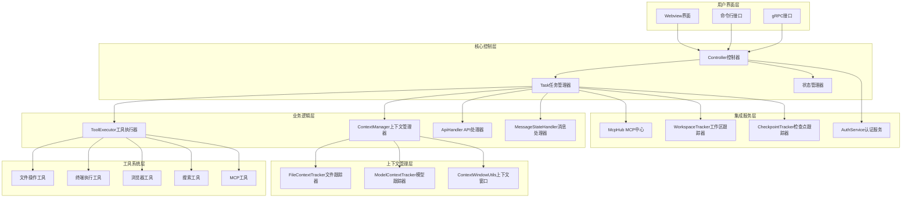

## 核心模块详细分析

### 1. Controller控制器层

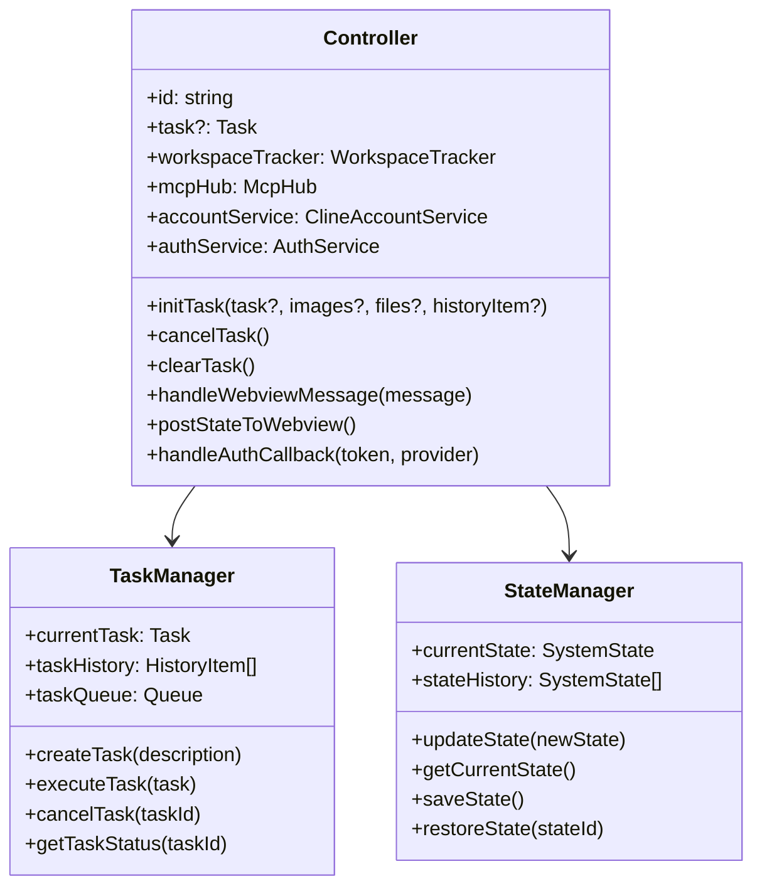

**核心职责**：
- **生命周期管理**：初始化、销毁、状态转换
- **消息路由**：处理Webview、CLI、gRPC消息
- **状态同步**：维护全局状态和UI同步
- **认证管理**：OAuth流程和API密钥管理

### 2. Task任务执行层

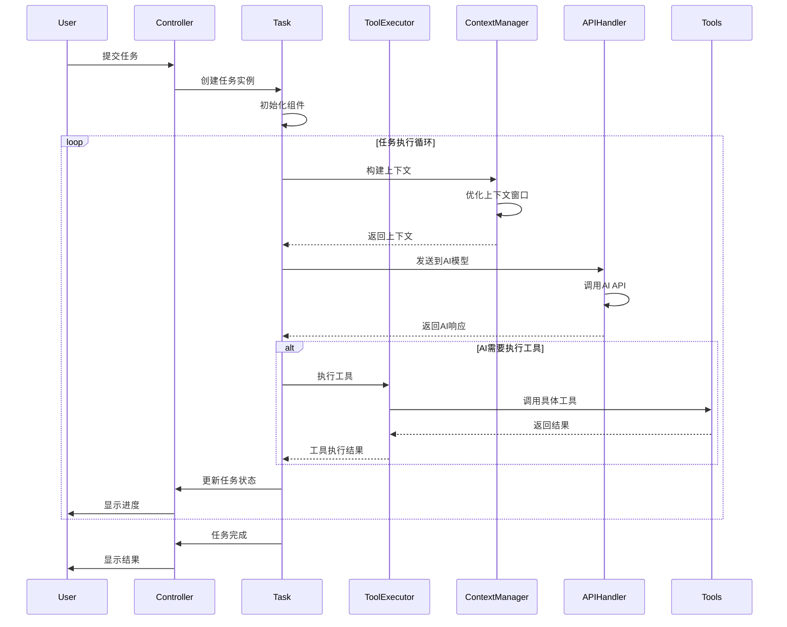

**核心组件**：
- **Task类**：任务生命周期管理
- **ToolExecutor**：工具执行和权限控制
- **MessageStateHandler**：消息状态管理
- **ContextManager**：上下文构建和优化

### 3. 工具执行系统

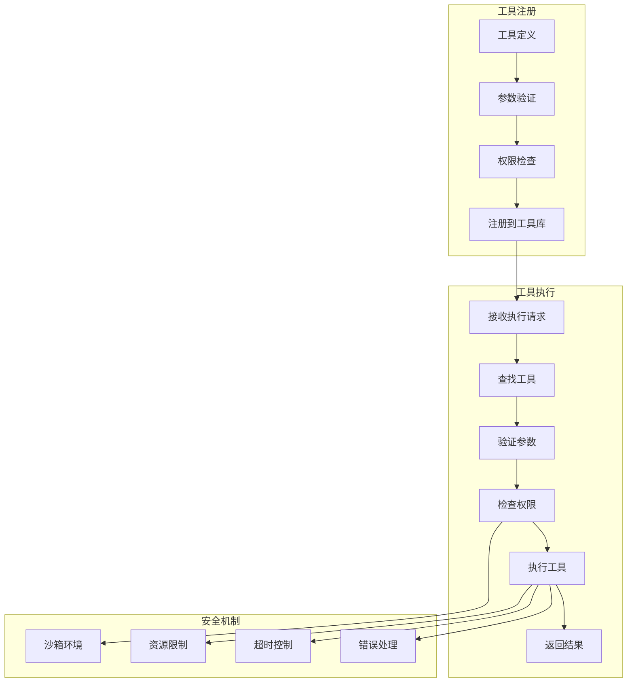

**支持的工具类型**：
- **文件操作**：read_file, write_to_file, replace_in_file
- **终端执行**：execute_command
- **浏览器控制**：browser_action
- **搜索工具**：grep_search
- **MCP工具**：use_mcp_tool

### 4. 上下文管理系统

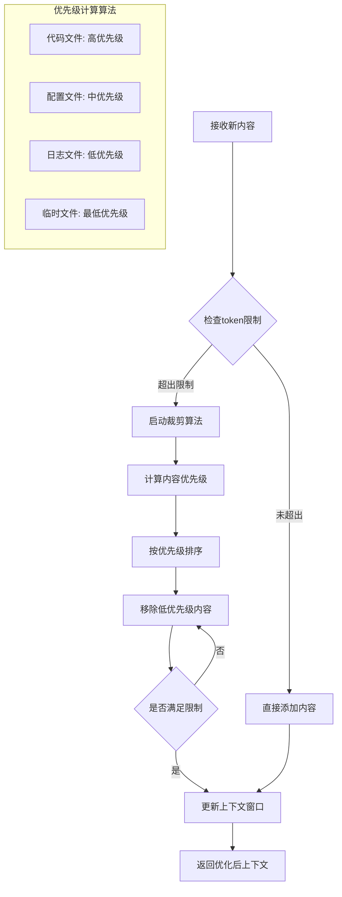

**核心组件**：
- **FileContextTracker**：文件操作跟踪
- **ModelContextTracker**：模型使用统计
- **ContextWindowUtils**：上下文窗口管理
- **ContextManager**：上下文构建和优化

### 5. API集成架构

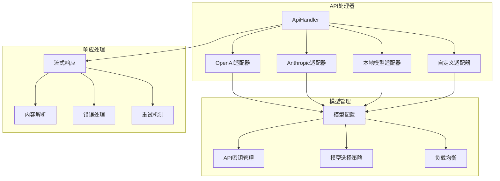

**支持的API提供商**：
- **OpenAI**：GPT-4, GPT-3.5
- **Anthropic**：Claude 3.5, Claude 3.7
- **OpenRouter**：多模型聚合
- **本地模型**：通过Transformers

## 数据流架构

### 1. 消息处理流程

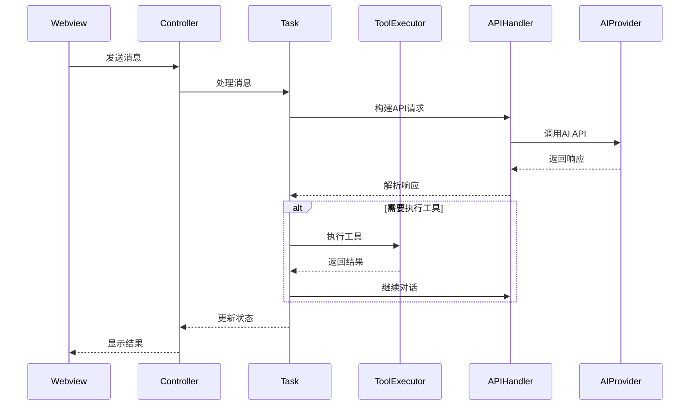

### 2. 状态管理流程

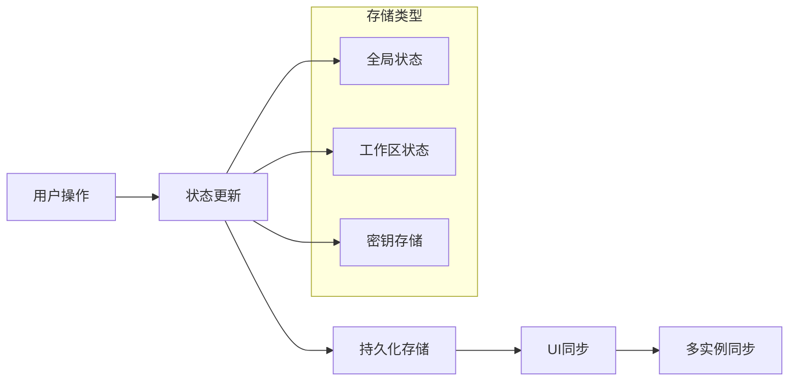

## 安全机制

### 1. 权限控制系统

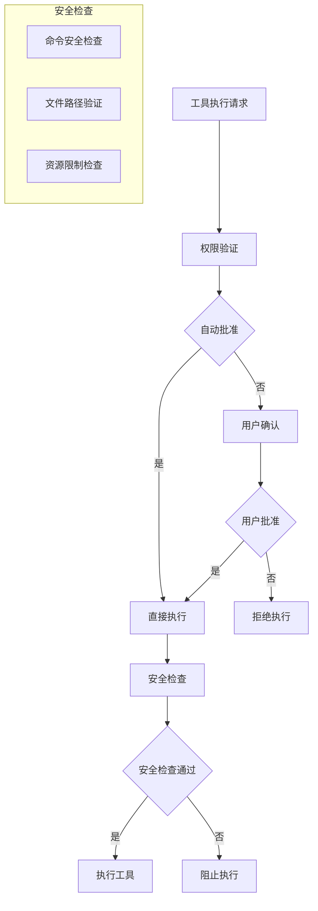

### 2. 沙箱环境

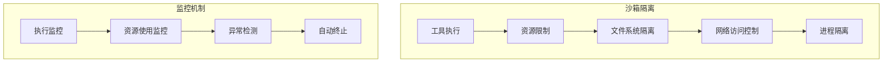

## 扩展机制

### 1. MCP协议集成

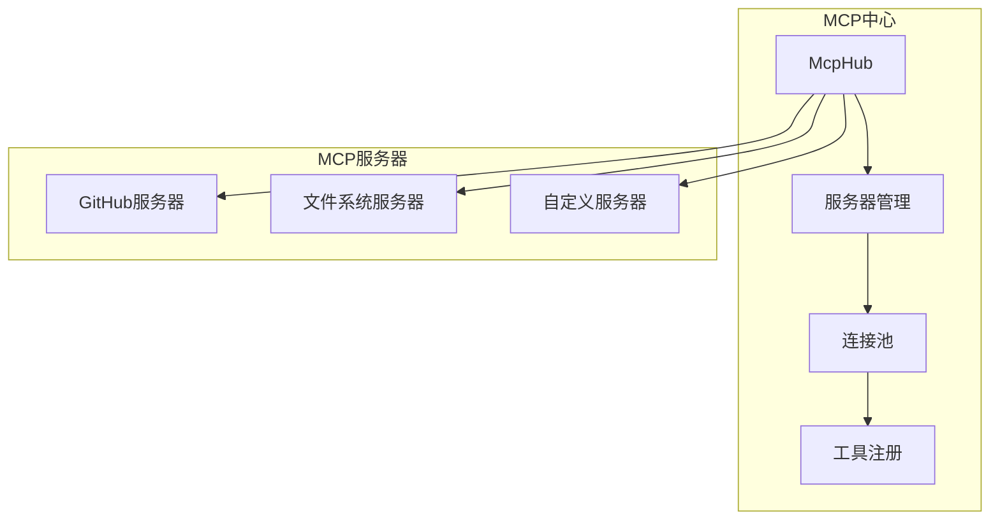

### 2. 插件系统

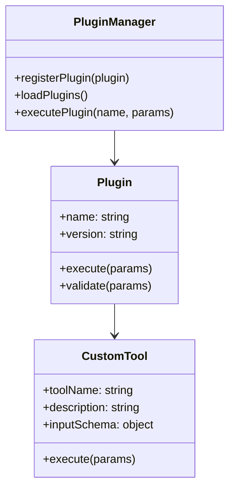

## 性能优化

### 1. 缓存策略

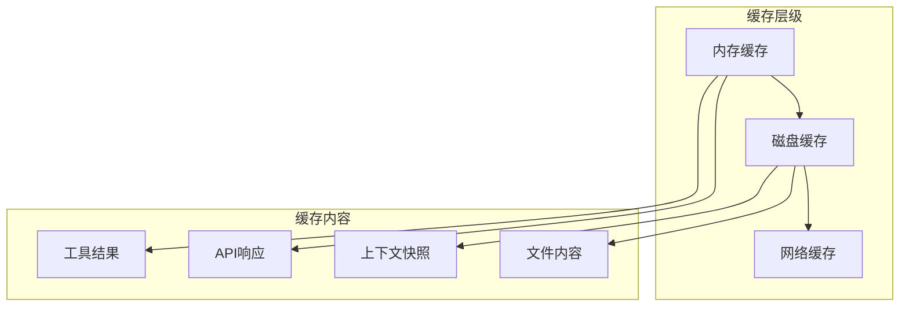

### 2. 异步处理

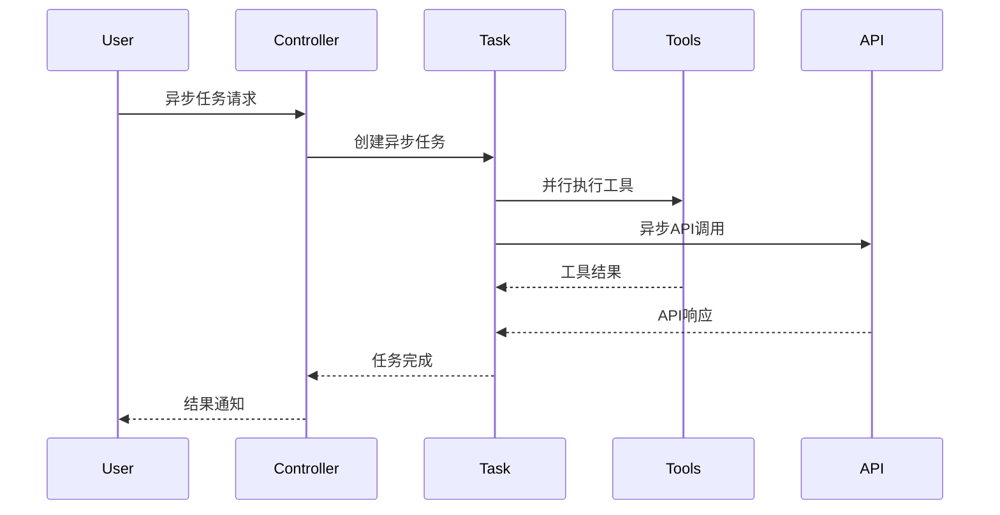

## 错误处理和恢复

### 1. 错误分类和处理

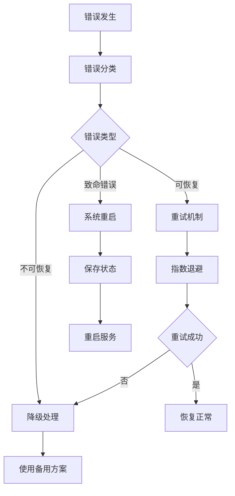

### 2. 检查点系统

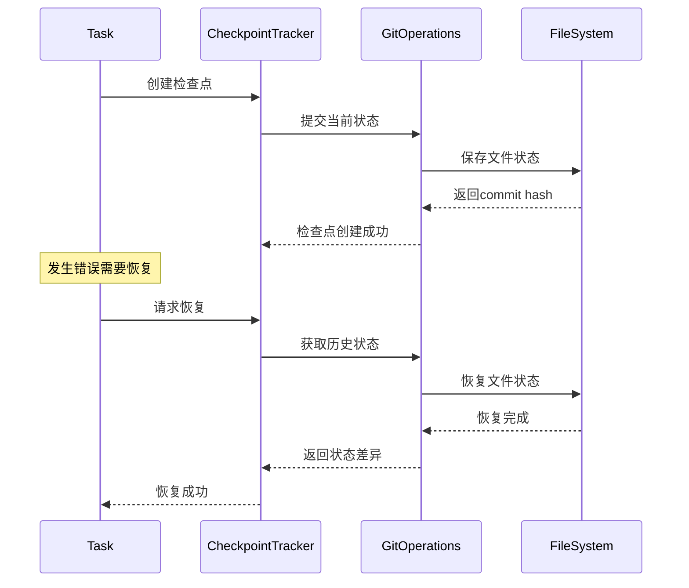

## 开发技术栈

### 1. 前端技术
- **React + TypeScript**：Webview界面
- **Tailwind CSS**：样式框架
- **Vite**：构建工具

### 2. 后端技术
- **Node.js + TypeScript**：核心逻辑
- **gRPC**：内部通信
- **WebSocket**：实时通信

### 3. 集成技术
- **VS Code Extension API**：扩展开发
- **MCP Protocol**：工具扩展
- **Git Integration**：版本控制

### 4. 数据存储
- **SQLite**：本地数据
- **JSON**：配置文件
- **VS Code Storage**：扩展存储

## 安全特性

### 1. 权限控制
- **最小权限原则**：按需授权
- **用户确认机制**：危险操作需要确认
- **自动批准配置**：可配置的安全策略

### 2. 沙箱环境
- **隔离执行**：工具在隔离环境中运行
- **资源限制**：CPU、内存、磁盘使用限制
- **网络控制**：限制网络访问

### 3. 审计日志
- **操作记录**：完整记录所有操作
- **用户行为分析**：分析使用模式
- **安全事件监控**：监控异常行为

## 核心功能场景

### 1. 智能代码助手
- **应用场景**: 开发者需要理解和修改现有代码库
- **功能特性**: 
  - 分析文件结构和源码AST
  - 运行正则搜索和读取相关文件
  - 管理上下文信息避免窗口溢出

### 2. 文件操作与编辑
- **应用场景**: 创建新文件或修改现有代码
- **功能特性**:
  - 直接创建和编辑文件
  - 监控linter/compiler错误并自动修复
  - 提供差异视图供用户确认修改

### 3. 终端命令执行
- **应用场景**: 需要运行构建脚本、安装依赖等
- **功能特性**:
  - 在终端中执行命令并监控输出
  - 适配开发环境和工具链
  - 支持长时间运行的进程

### 4. 浏览器自动化
- **应用场景**: Web开发和调试
- **功能特性**:
  - 启动无头浏览器
  - 点击、输入、滚动操作
  - 捕获截图和console日志

### 5. MCP工具扩展
- **应用场景**: 扩展AI能力边界
- **功能特性**:
  - 通过Model Context Protocol添加自定义工具
  - 动态创建和安装MCP服务器
  - 集成第三方服务和API

## 关键运行模式

1. **Plan模式**: 分析任务并制定执行计划
2. **Act模式**: 执行具体操作和代码修改
3. **混合模式**: 根据需要在两种模式间切换

## 扩展机制

- **MCP协议**: 支持动态添加新工具
- **多模型支持**: OpenRouter、Anthropic、OpenAI等
- **自定义规则**: Cline Rules系统
- **主题适配**: 支持VS Code主题

这个详细的架构概览展示了Cline系统的完整设计，包括各个模块之间的关系、数据流、安全机制和扩展能力。每个组件都有明确的职责分工，通过标准化的接口进行通信，确保了系统的可维护性和可扩展性。