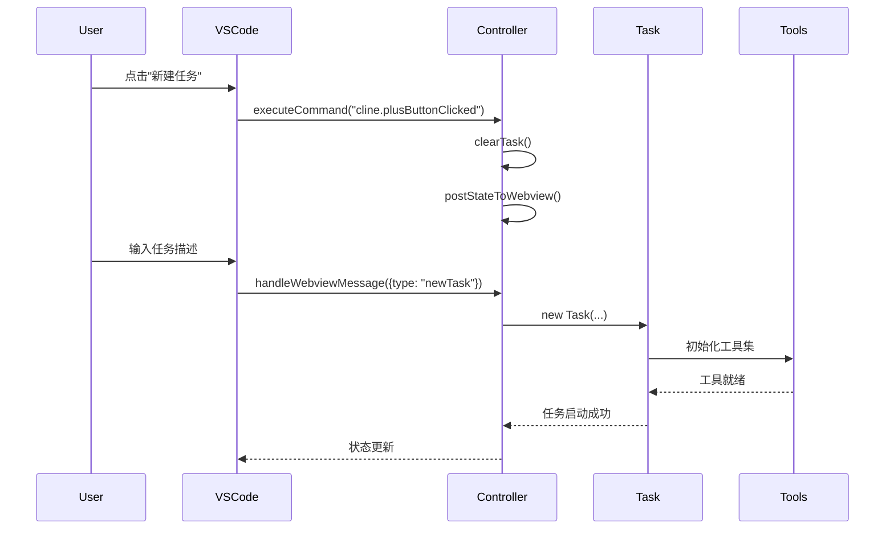

# Cline核心模块分析 - Controller层

## Controller类职责

Controller类是Cline的核心控制器，负责协调UI交互、任务管理和系统状态维护。位于`src/core/controller/index.ts:45`，是整个系统的中枢神经。

## 核心功能

### 1. 生命周期管理

```typescript
// 构造函数：初始化核心组件
constructor(
    readonly context: vscode.ExtensionContext,
    private readonly outputChannel: vscode.OutputChannel,
    postMessage: (message: ExtensionMessage) => Thenable<boolean> | undefined,
    id: string,
)
```

初始化过程：
- 创建工作区跟踪器 (`WorkspaceTracker`)
- 初始化MCP中心 (`McpHub`) 
- 设置账户服务 (`ClineAccountService`)
- 配置认证服务 (`AuthService`)

### 2. 任务管理

#### 任务创建流程
```typescript
// src/core/controller/index.ts:137
async initTask(task?: string, images?: string[], files?: string[], historyItem?: HistoryItem)
```

**输入参数**:
- `task`: 任务描述文本
- `images`: 图片数据数组
- `files`: 相关文件路径
- `historyItem`: 历史任务记录

**处理流程**:
1. 清除现有任务 (`clearTask()`)
2. 获取扩展状态配置
3. 构建聊天设置
4. 创建Task实例
5. 初始化任务执行环境

#### 任务状态转换
```typescript
// 任务状态管理
- initTask()    // 初始化新任务
- cancelTask()  // 取消当前任务  
- clearTask()   // 清除任务状态
- reinitExistingTaskFromId() // 从历史恢复任务
```

### 3. 消息处理系统

#### Webview消息处理
```typescript
// src/core/controller/index.ts:220
async handleWebviewMessage(message: WebviewMessage)
```

**支持的消息类型**:
- `fetchMcpMarketplace`: 获取MCP市场数据
- `grpc_request`: gRPC请求处理
- `grpc_request_cancel`: 取消gRPC请求

#### 状态同步机制
```typescript
// 状态广播
async postStateToWebview()
async getStateToPostToWebview(): Promise<ExtensionState>
```

**状态包含信息**:
- API配置信息
- 任务历史记录
- 用户设置
- MCP服务器状态
- 聊天配置

### 4. 上下文菜单集成

#### 代码操作
```typescript
// 添加选中代码到聊天
async addSelectedCodeToChat(code: string, filePath: string, languageId: string, diagnostics?: vscode.Diagnostic[])

// 修复代码问题
async fixWithCline(code: string, filePath: string, languageId: string, diagnostics: vscode.Diagnostic[])
```

#### 终端操作
```typescript
// 添加终端输出到聊天
async addSelectedTerminalOutputToChat(output: string, terminalName: string)
```

### 5. 认证管理

#### 登录流程
```typescript
// src/core/controller/index.ts:322
async handleAuthCallback(customToken: string, provider: string | null = null)
```

**处理步骤**:
1. 验证OAuth回调
2. 更新用户状态
3. 配置API提供商
4. 同步到所有实例

#### 登出流程
```typescript
// src/core/controller/index.ts:111
async handleSignOut()
```

## 事件系统

### 1. 内部事件
- 状态更新事件
- 任务完成事件
- 错误报告事件

### 2. 外部事件
- VS Code命令事件
- Webview消息事件
- 文件系统事件

### 3. 事件流示例



## 配置管理

### 1. 全局状态存储
```typescript
// 存储键值对
- mode: 当前运行模式
- chatSettings: 聊天配置
- apiConfiguration: API配置
- taskHistory: 任务历史
```

### 2. 密钥管理
```typescript
// 安全存储
- clineAccountId: 用户账户ID
- openRouterApiKey: API密钥
```

### 3. 设置同步
- 本地设置与全局设置的同步机制
- 多实例间的配置一致性保证

## 错误处理

### 1. 异常捕获
```typescript
// 统一的错误处理机制
try {
    // 业务逻辑
} catch (error) {
    console.error("Operation failed:", error)
    HostProvider.window.showMessage({
        type: ShowMessageType.ERROR,
        message: errorMessage,
    })
}
```

### 2. 状态恢复
- 任务中断后的状态恢复
- 配置错误的自动修复
- 历史记录的完整性保证

## 性能优化

### 1. 内存管理
- 及时清理完成的任务
- 避免内存泄漏的disposable模式
- 大文件的分块处理

### 2. 缓存策略
- API响应缓存
- 文件内容缓存
- 状态快照机制

### 3. 异步处理
- 非阻塞的任务启动
- 并发的状态更新
- 延迟加载策略