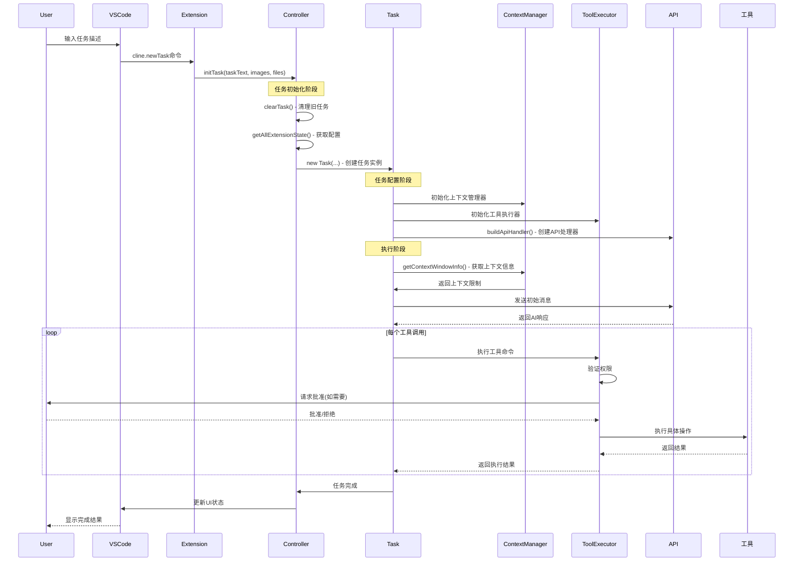
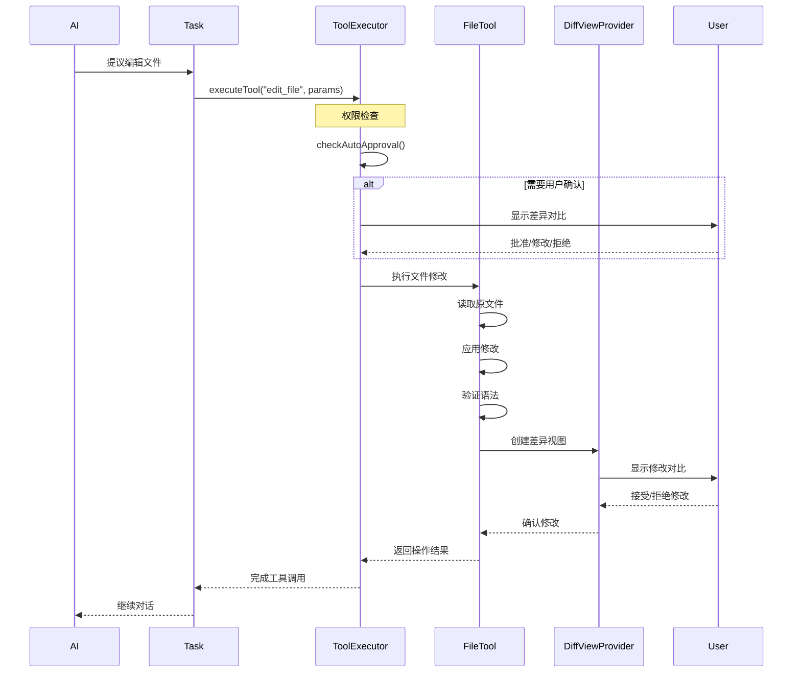
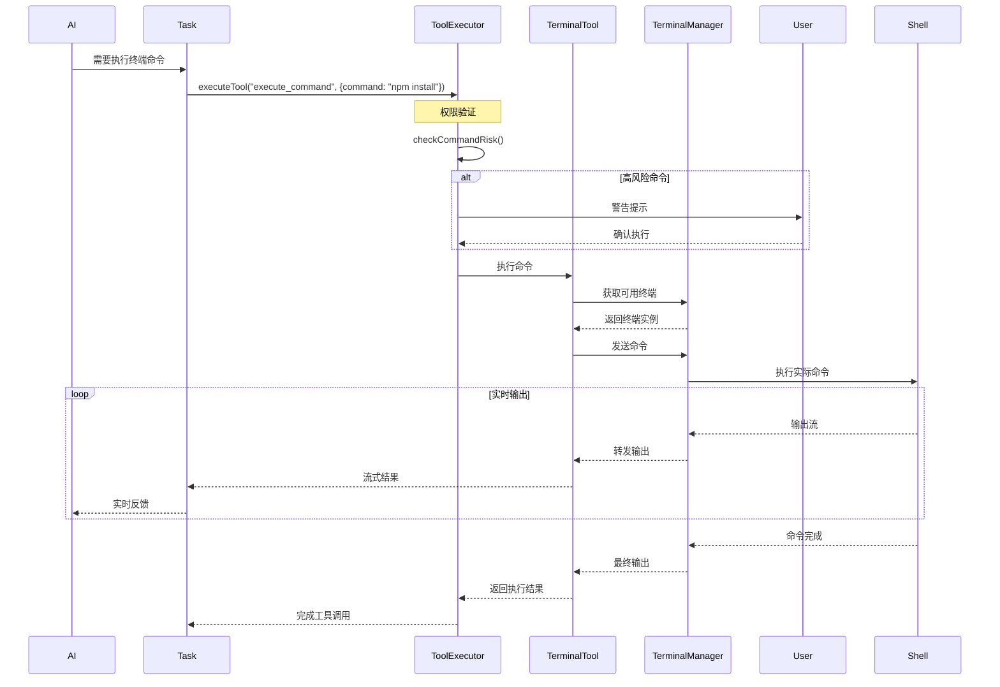
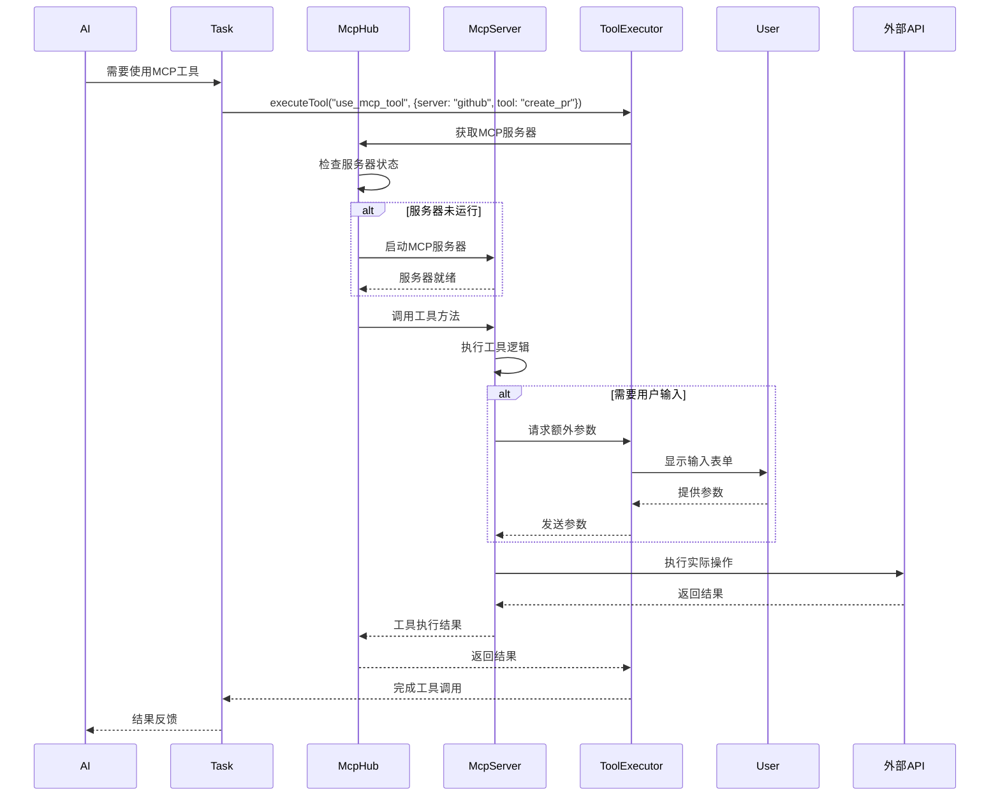
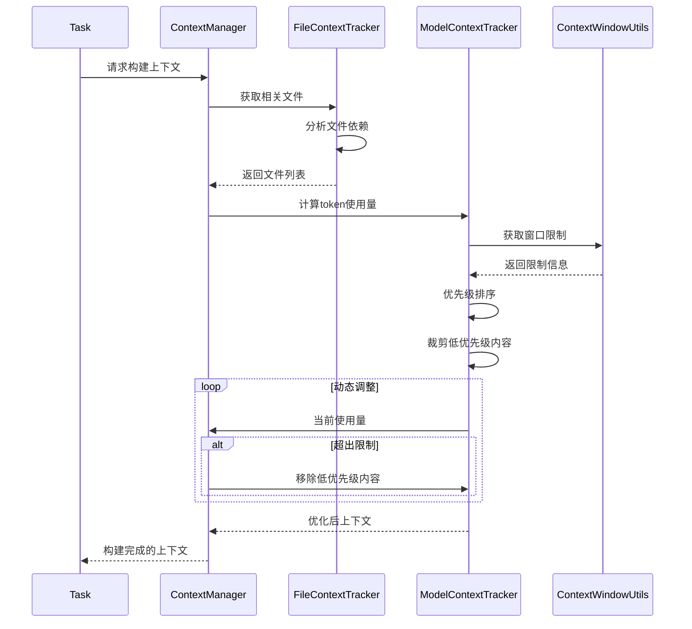
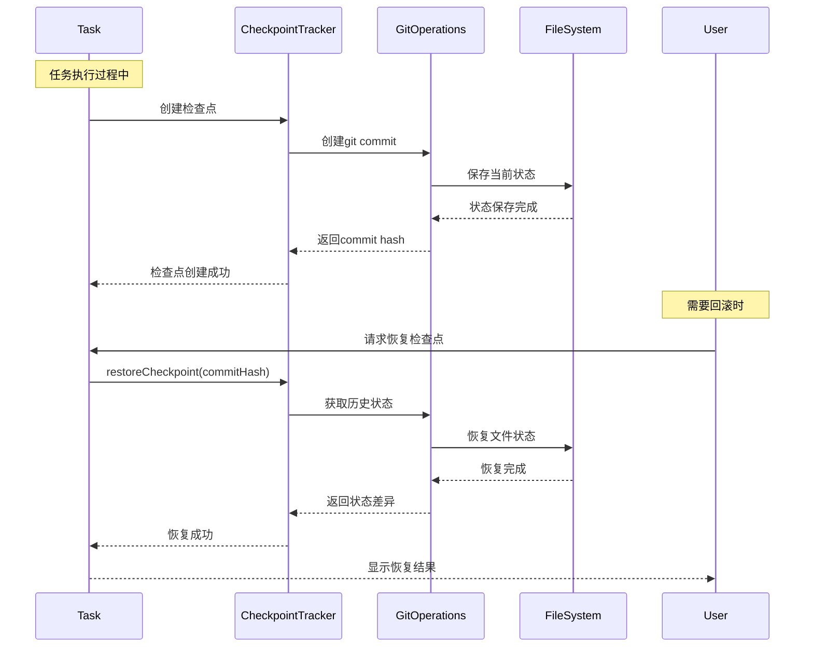
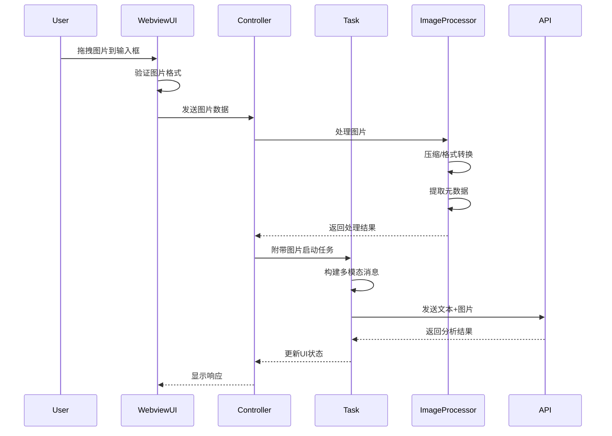
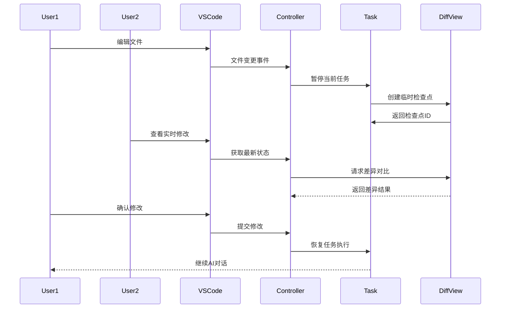
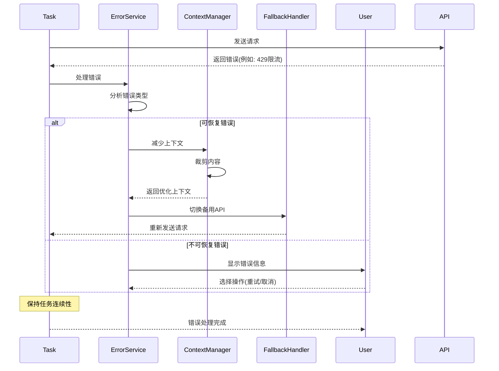
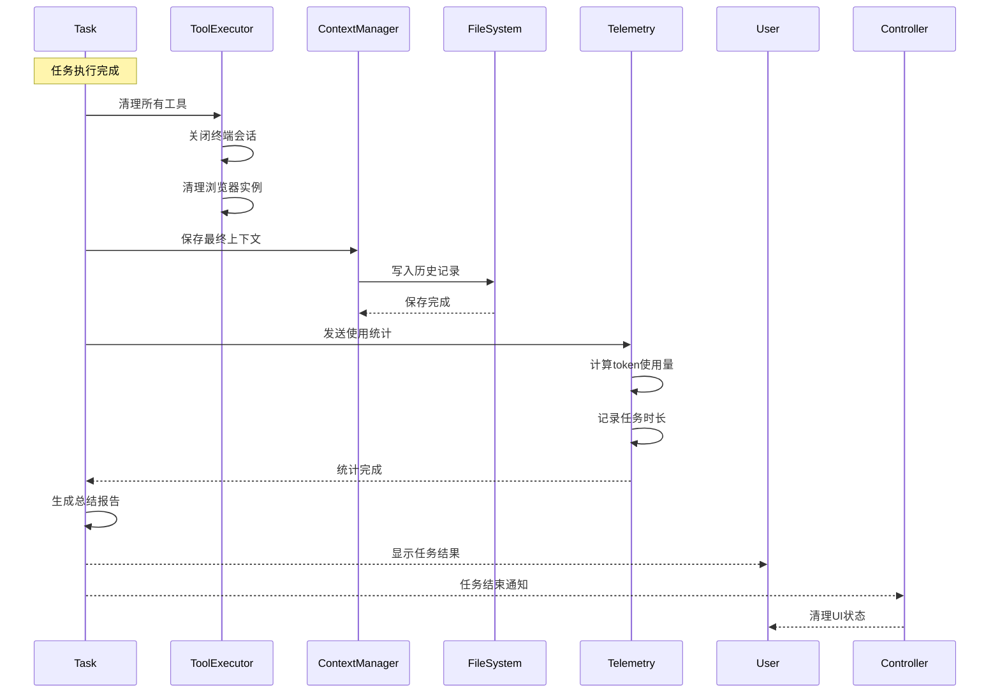

# Cline任务执行流程 - Mermaid时序图

## 1. 任务启动完整流程

## 2. 文件编辑操作流程

## 3. 终端命令执行流程

## 4. MCP工具调用流程

## 5. 上下文管理流程

## 6. 检查点(Checkpoint)系统

## 7. 多模态交互流程

## 8. 实时协作编辑

## 9. 错误处理与恢复

## 10. 任务完成与清理

