# Cline核心模块详细分析

## 1. Controller控制器层

### 1.1 类结构设计

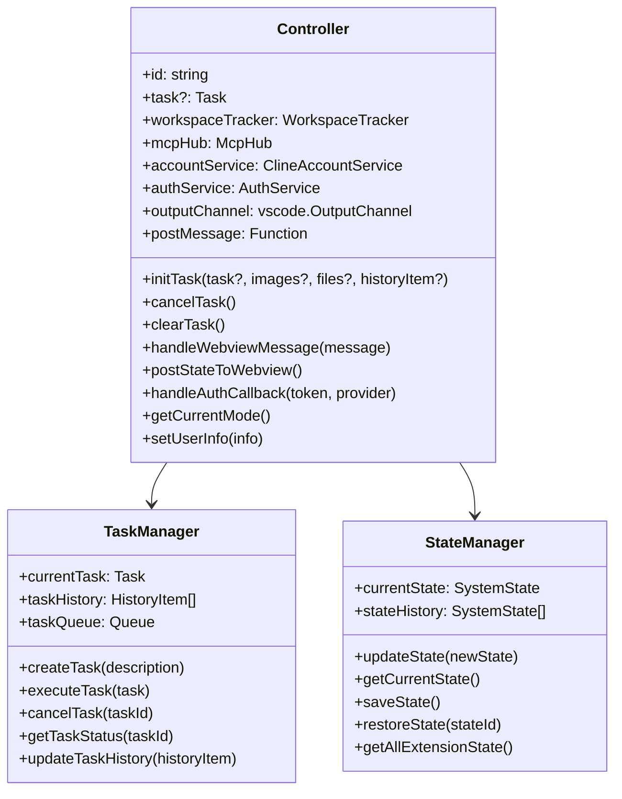

### 1.2 初始化流程

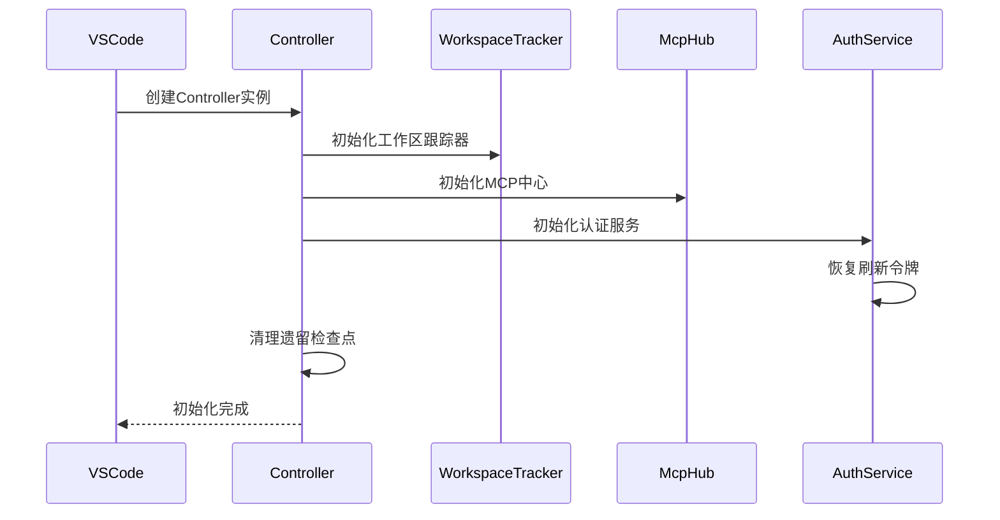

### 1.3 消息处理机制

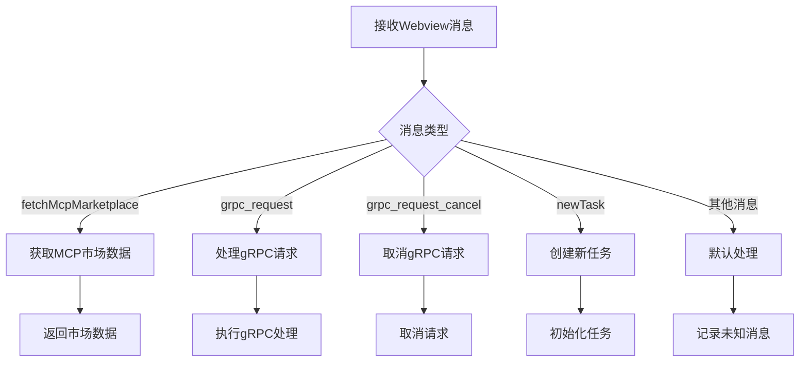

## 2. Task任务执行层

### 2.1 Task类结构

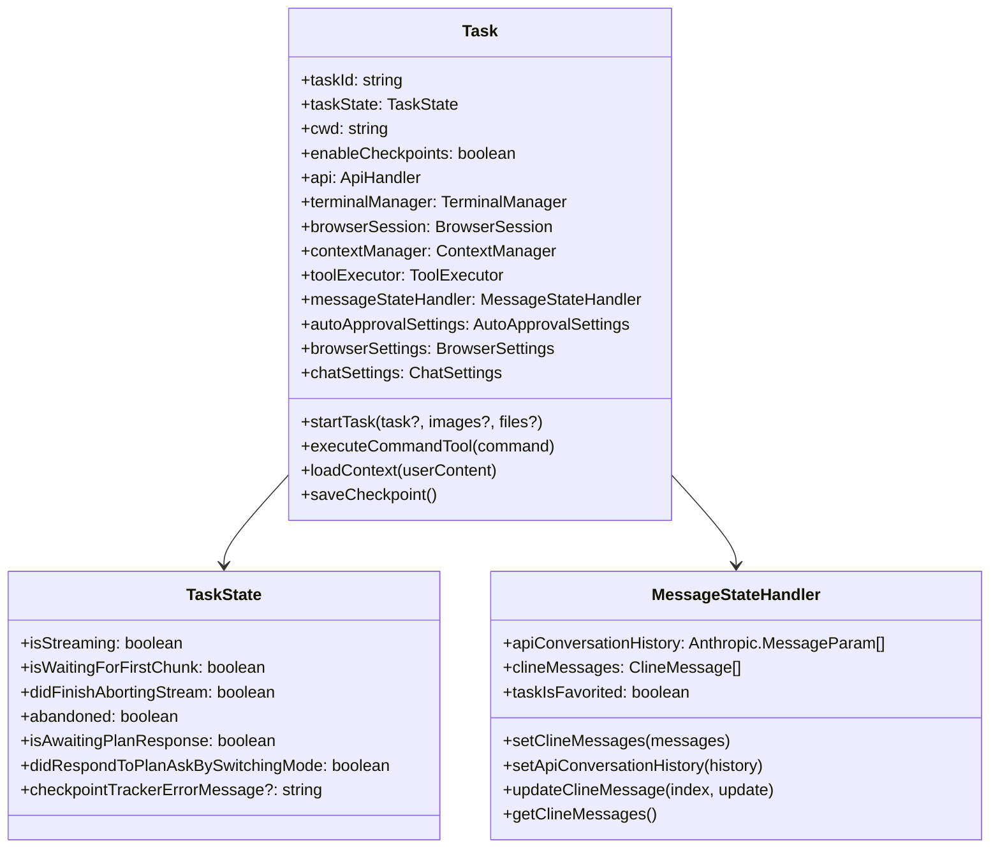

### 2.2 任务执行流程

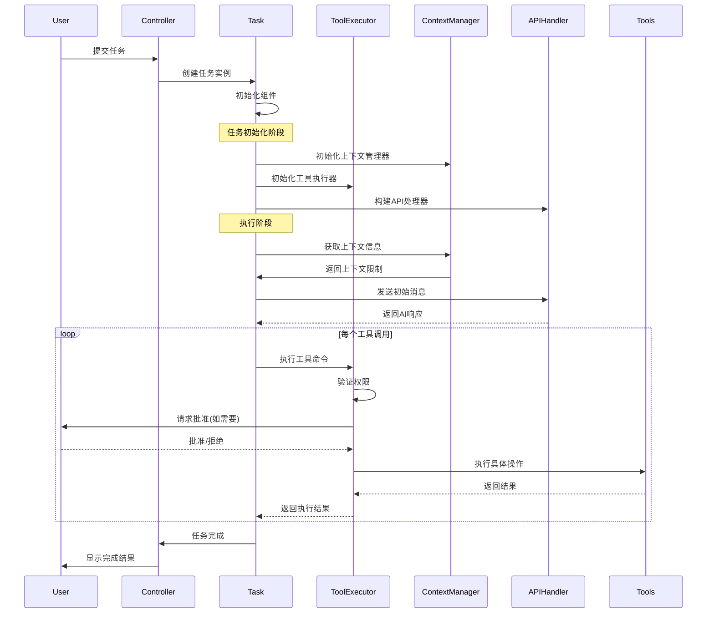

### 2.3 任务状态管理

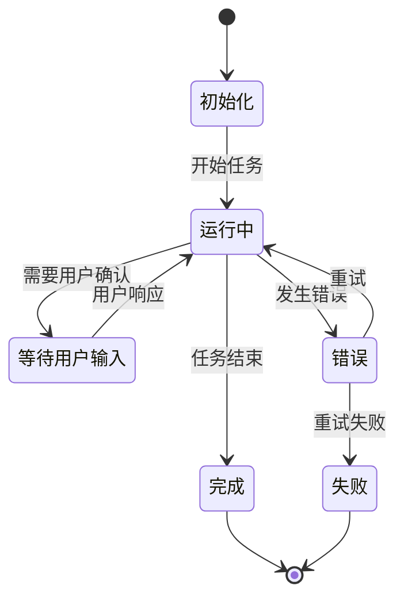

## 3. ToolExecutor工具执行器

### 3.1 工具执行器架构

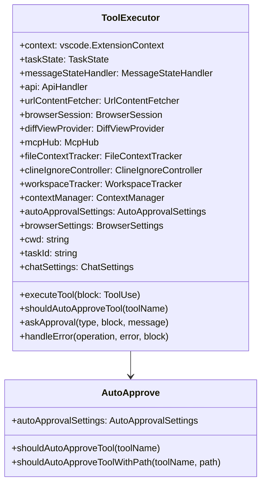

### 3.2 工具执行流程

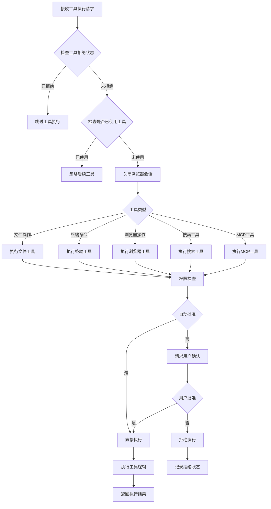

### 3.3 支持的工具类型

#### 文件操作工具
- **read_file**: 读取文件内容
- **write_to_file**: 写入文件内容
- **replace_in_file**: 替换文件内容
- **new_rule**: 创建新规则文件

#### 终端执行工具
- **execute_command**: 执行终端命令
- **attempt_completion**: 尝试完成任务

#### 浏览器工具
- **browser_action**: 浏览器操作（点击、输入、滚动等）
- **web_fetch**: 获取网页内容

#### 搜索工具
- **grep_search**: 文件内容搜索
- **list_directory**: 列出目录内容

#### MCP工具
- **use_mcp_tool**: 使用MCP服务器工具
- **access_mcp_resource**: 访问MCP资源

## 4. ContextManager上下文管理器

### 4.1 上下文管理架构

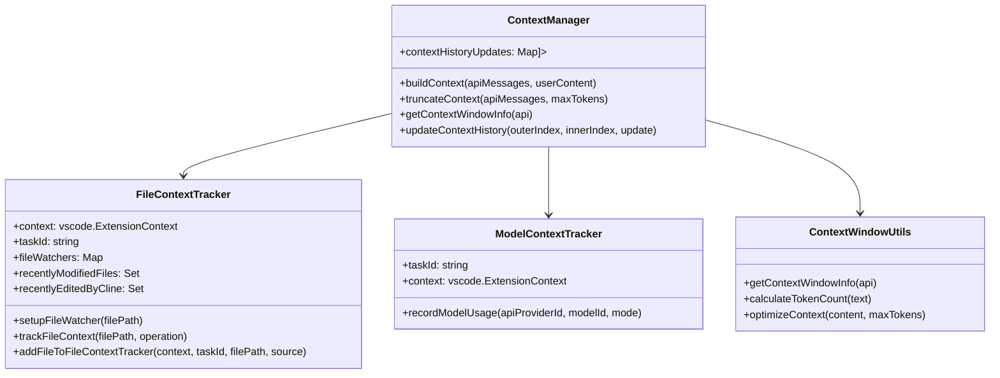

### 4.2 上下文构建流程

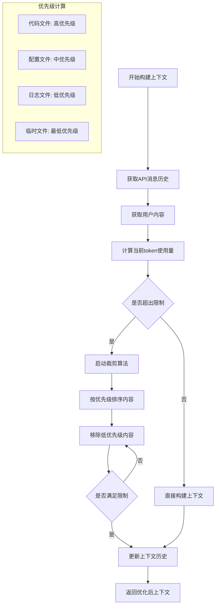

### 4.3 文件跟踪机制

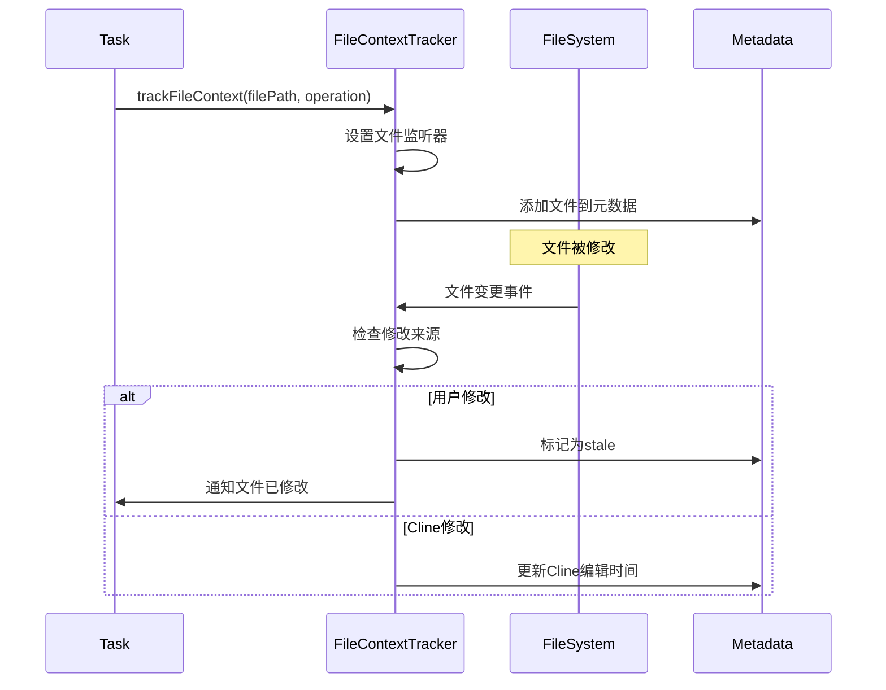

## 5. API处理器架构

### 5.1 API处理器设计

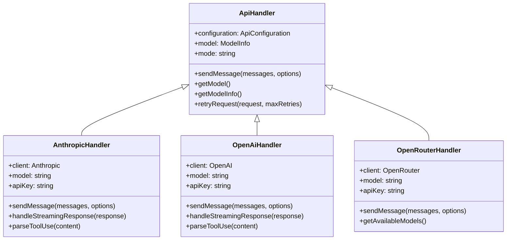

### 5.2 API调用流程

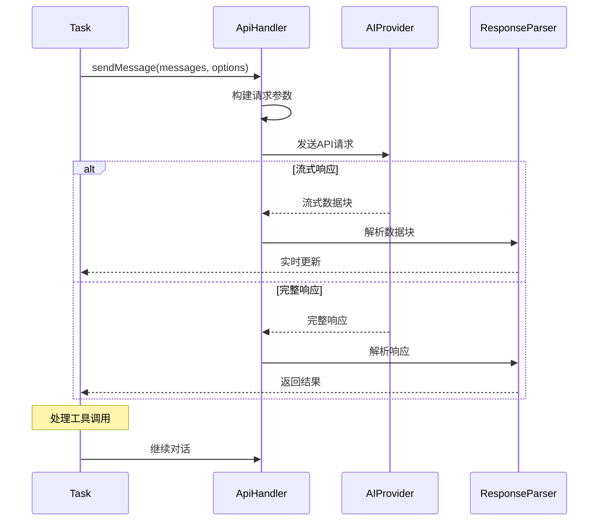

### 5.3 错误处理和重试

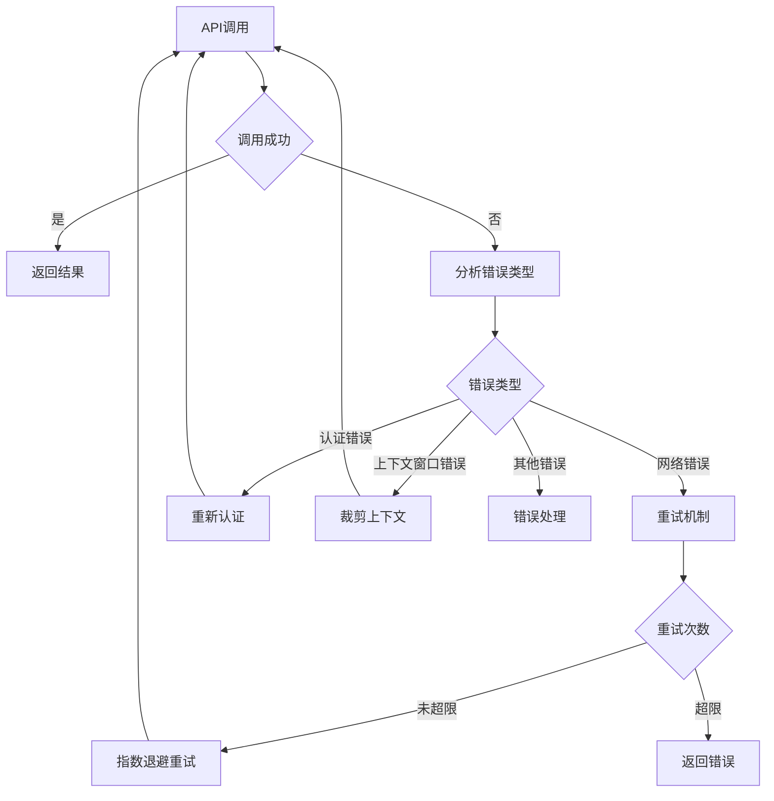

## 6. 消息状态管理

### 6.1 消息状态处理器

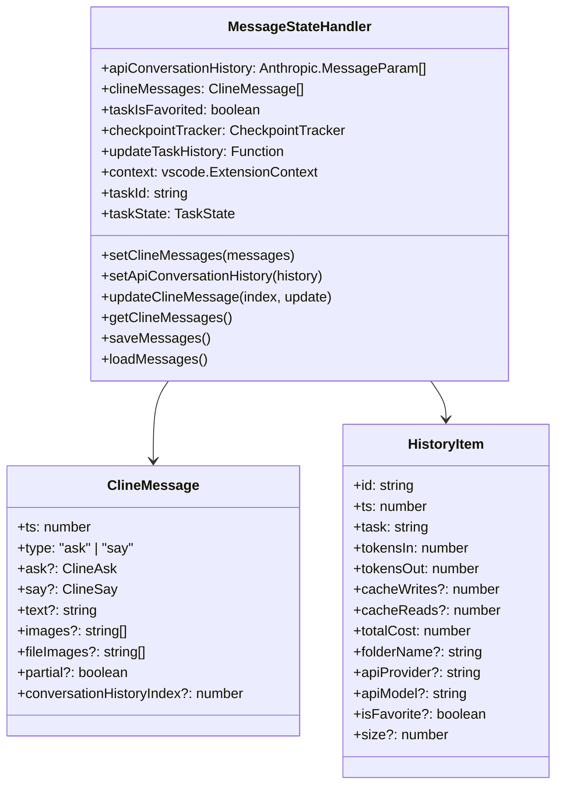

### 6.2 消息同步流程

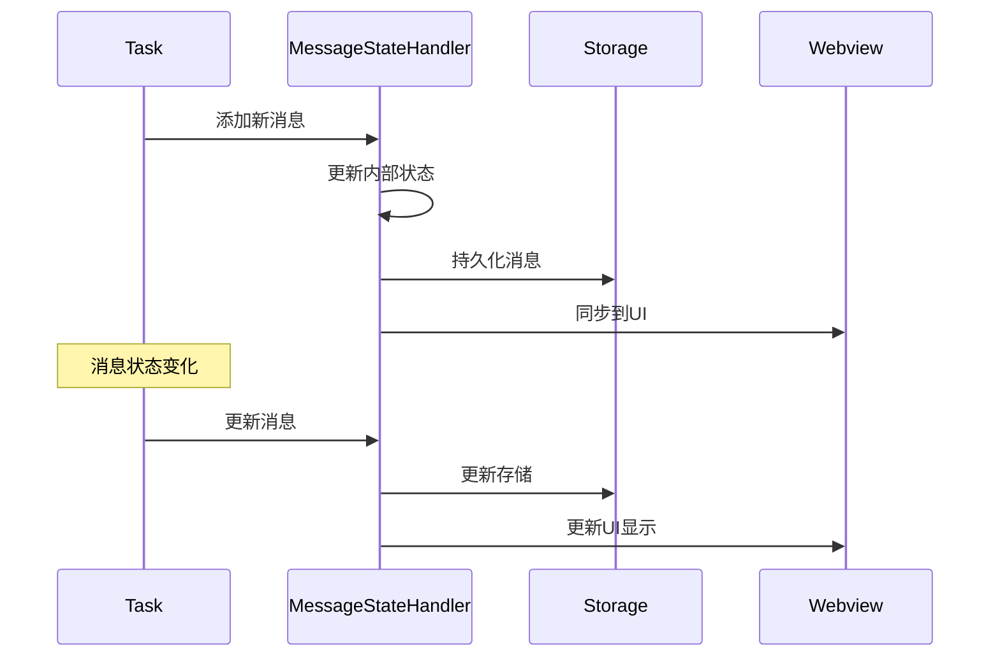

这个核心模块详细分析文档展示了Cline系统中各个核心组件的设计、职责和交互关系，为理解系统架构提供了深入的技术细节。 