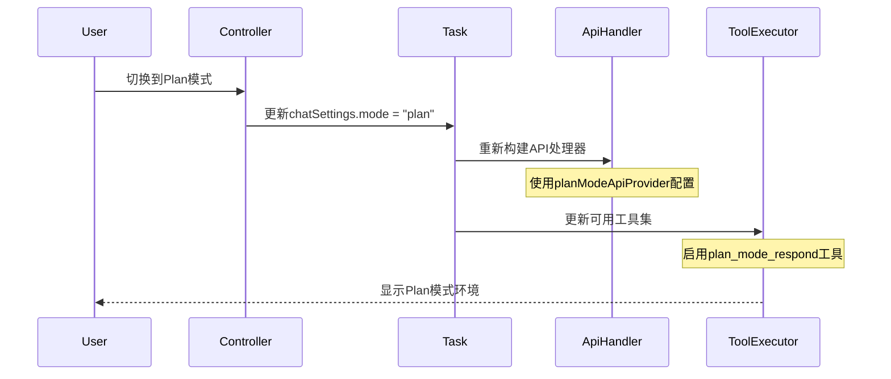
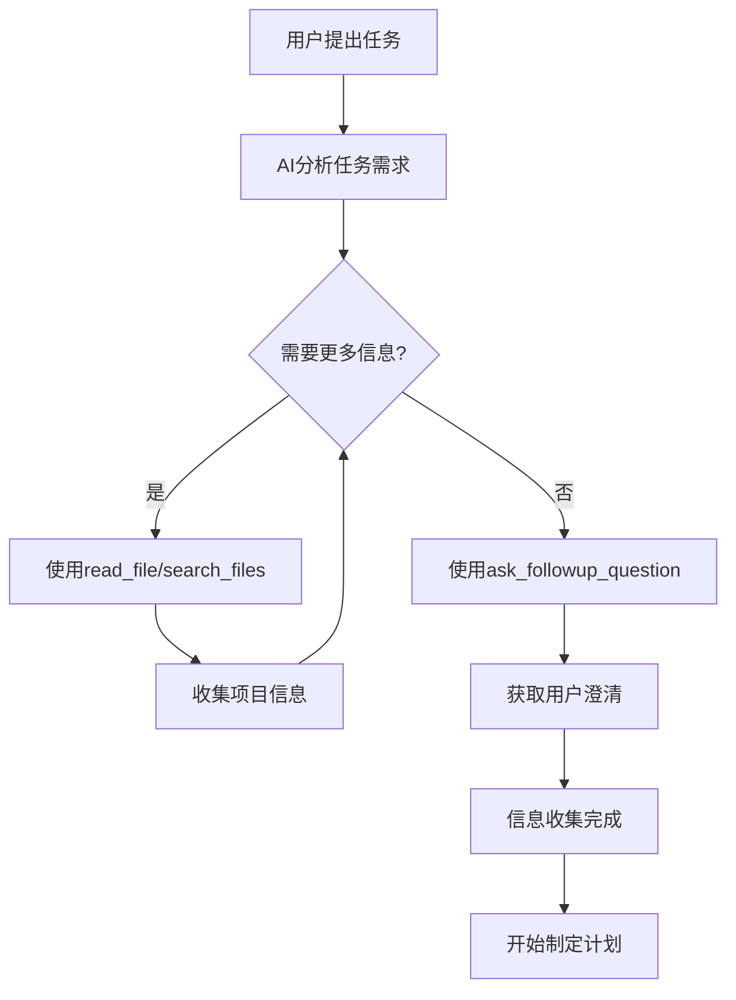
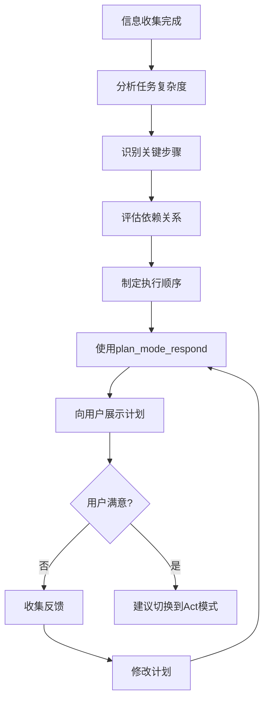
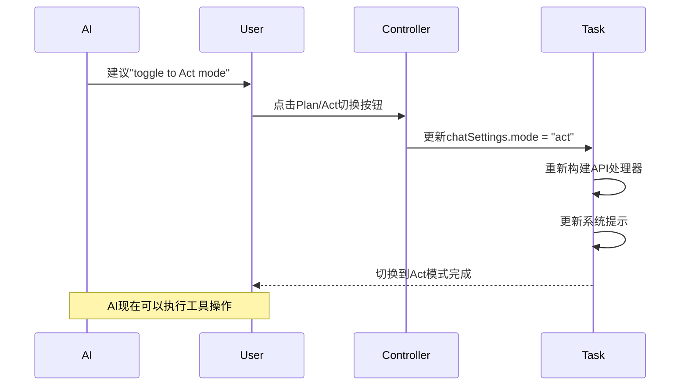

# Cline Plan模式实现细节分析

基于对Cline源码的深入分析，详细解析Plan模式的具体实现机制和技术细节。

## 🔧 核心实现组件

### 1. Plan模式响应工具 (planModeRespondTool)

#### 工具定义
```typescript
// src/core/tools/planModeRespondTool.ts
const descriptionForAgent = `Respond to the user's inquiry in an effort to plan a solution to the user's task. This tool should be used when you need to provide a response to a question or statement from the user about how you plan to accomplish the task. This tool is only available in PLAN MODE.`

export const planModeRespondToolDefinition = {
    name: "plan_mode_respond",
    description: descriptionForAgent,
    inputSchema: {
        type: "object",
        properties: {
            response: {
                type: "string",
                description: "The response to provide to the user. Do not try to use tools in this parameter, this is simply a chat response."
            }
        },
        required: ["response"]
    }
}
```

#### 工具执行逻辑
```typescript
// src/core/task/ToolExecutor.ts
case "plan_mode_respond": {
    const response: string | undefined = block.params.response
    
    if (!response) {
        this.taskState.consecutiveMistakeCount++
        this.pushToolResult(
            await this.sayAndCreateMissingParamError("plan_mode_respond", "response"), 
            block
        )
        break
    }

    // 处理部分响应
    if (block.partial) {
        await this.ask("plan_mode_respond", JSON.stringify(sharedMessage), block.partial)
        break
    }

    // 处理完整响应
    const { response: userResponse, text: planResponseText, images: planResponseImages, files: planResponseFiles } = 
        await this.ask("plan_mode_respond", JSON.stringify(sharedMessage), false)
    
    this.taskState.isAwaitingPlanResponse = false
    
    // 处理用户反馈
    if (userResponse === "messageResponse") {
        await this.say("user_feedback", planResponseText, planResponseImages, planResponseFiles)
        await this.saveCheckpoint()
    }
    
    break
}
```

### 2. 模式切换机制

#### API提供商选择
```typescript
// src/core/task/index.ts
const currentProvider = chatSettings.mode === "plan" 
    ? apiConfiguration.planModeApiProvider 
    : apiConfiguration.actModeApiProvider

// 推理强度配置
if (currentProvider === "openai" || currentProvider === "openai-native") {
    if (chatSettings.mode === "plan") {
        effectiveApiConfiguration.planModeReasoningEffort = chatSettings.openAIReasoningEffort
    } else {
        effectiveApiConfiguration.actModeReasoningEffort = chatSettings.openAIReasoningEffort
    }
}
```

#### API处理器构建
```typescript
// src/api/index.ts
export function buildApiHandler(options: ApiConfiguration, mode: "plan" | "act"): ApiHandler {
    // 根据模式选择不同的模型配置
    const apiModelId = mode === "plan" ? options.planModeApiModelId : options.actModeApiModelId
    const thinkingBudgetTokens = mode === "plan" ? options.planModeThinkingBudgetTokens : options.actModeThinkingBudgetTokens
    
    // 为不同提供商构建相应的处理器
    switch (apiProvider) {
        case "anthropic":
            return new AnthropicHandler({
                apiModelId,
                thinkingBudgetTokens,
                // ... 其他配置
            })
        case "openai":
            return new OpenAiHandler({
                openAiModelId: mode === "plan" ? options.planModeOpenAiModelId : options.actModeOpenAiModelId,
                reasoningEffort: mode === "plan" ? options.planModeReasoningEffort : options.actModeReasoningEffort,
                // ... 其他配置
            })
        // ... 其他提供商
    }
}
```

### 3. 系统提示差异化

#### 基础系统提示
```typescript
// src/core/prompts/system.ts
export const SYSTEM_PROMPT = async (cwd: string, supportsBrowserUse: boolean, mcpHub: McpHub, browserSettings: BrowserSettings, isNextGenModel: boolean = false) => {
    
    // 根据模型类型选择不同的提示模板
    if (isNextGenModel && USE_EXPERIMENTAL_CLAUDE4_FEATURES) {
        return SYSTEM_PROMPT_CLAUDE4_EXPERIMENTAL(cwd, supportsBrowserUse, mcpHub, browserSettings)
    }
    
    if (isNextGenModel) {
        return SYSTEM_PROMPT_CLAUDE4(cwd, supportsBrowserUse, mcpHub, browserSettings)
    }
    
    // 标准系统提示包含Plan/Act模式说明
    return `You are Cline, a highly skilled software engineer...
    
====

ACT MODE V.S. PLAN MODE

- ACT MODE: In this mode, you have access to all tools EXCEPT the plan_mode_respond tool.
- PLAN MODE: In this special mode, you have access to the plan_mode_respond tool.
  - In PLAN MODE, the goal is to gather information and get context to create a detailed plan for accomplishing the task, which the user will review and approve before they switch you to ACT MODE to implement the solution.

## What is PLAN MODE?

- When starting in PLAN MODE, depending on the user's request, you may need to do some information gathering e.g. using read_file or search_files to get more context about the task.
- Once you've gained more context about the user's request, you should architect a detailed plan for how you will accomplish the task.
- Then you might ask the user if they are pleased with this plan, or if they would like to make any changes.
- Finally once it seems like you've reached a good plan, ask the user to switch you back to ACT MODE to implement the solution.`
}
```

#### Claude 4专用提示
```typescript
// src/core/prompts/model_prompts/claude4.ts
const planModeInstructions = `
## plan_mode_respond
Description: Respond to the user's inquiry in an effort to plan a solution to the user's task. This tool should ONLY be used when you have already explored the relevant files and are ready to present a concrete plan. DO NOT use this tool to announce what files you're going to read - just read them first.

CRITICAL: You must complete your information gathering (reading files, exploring the codebase) BEFORE using this tool. The user expects to see a well thought-out plan based on actual analysis, not intentions.

- When starting in PLAN MODE, depending on the user's request, you may need to do some information gathering e.g. using read_file or search_files to get more context about the task.
- Once you've gained more context about the user's request, you should architect a detailed plan for how you will accomplish the task. Present the plan to the user using the plan_mode_respond tool.
- Then you might ask the user if they are pleased with this plan, or if they would like to make any changes.
- Finally once it seems like you've reached a good plan, ask the user to switch you back to ACT MODE to implement the solution.`
```

### 4. 环境详情差异化

#### 模式状态显示
```typescript
// src/core/task/index.ts - getEnvironmentDetails方法
details += "\n\n# Current Mode"
if (this.chatSettings.mode === "plan") {
    details += "\nPLAN MODE\n" + formatResponse.planModeInstructions()
} else {
    details += "\nACT MODE"
}
```

#### Plan模式指令
```typescript
// src/core/prompts/responses.ts
planModeInstructions: () => {
    return `In this mode you should focus on information gathering, asking questions, and architecting a solution. Once you have a plan, use the plan_mode_respond tool to engage in a conversational back and forth with the user. Do not use the plan_mode_respond tool until you've gathered all the information you need e.g. with read_file or ask_followup_question.

(Remember: If it seems the user wants you to use tools only available in Act Mode, you should ask the user to "toggle to Act mode" (use those words) - they will have to manually do this themselves with the Plan/Act toggle button below. You do not have the ability to switch to Act Mode yourself, and must wait for the user to do it themselves once they are satisfied with the plan.)`
}
```

### 5. 任务恢复机制

#### 恢复消息格式化
```typescript
// src/core/prompts/responses.ts
taskResumption: (mode: "plan" | "act", agoText: string, cwd: string, wasRecent: boolean, responseText?: string, hasPendingFileContextWarnings?: boolean) => {
    
    const taskResumptionMessage = mode === "plan"
        ? `This task was interrupted ${agoText}. The conversation may have been incomplete. Be aware that the project state may have changed since then. The current working directory is now '${cwd.toPosix()}'.\n\nNote: If you previously attempted a tool use that the user did not provide a result for, you should assume the tool use was not successful. However you are in PLAN MODE, so rather than continuing the task, you must respond to the user's message.`
        : `This task was interrupted ${agoText}. The conversation may have been incomplete. Be aware that the project state may have changed since then. The current working directory is now '${cwd.toPosix()}'.\n\nNote: If you previously attempted a tool use that the user did not provide a result for, you should assume the tool use was not successful and may need to retry or approach the task differently.`

    const userResponseMessage = responseText
        ? `${mode === "plan" ? "New message to respond to with plan_mode_respond tool (be sure to provide your response in the <response> parameter)" : "New instructions for task continuation"}:\n<user_message>\n${responseText}\n</user_message>`
        : mode === "plan"
            ? "(The user did not provide a new message. Consider asking them how they'd like you to proceed, or suggest to them to switch to Act mode to continue with the task.)"
            : "(The user did not provide new instructions. Continue with the task as you see fit, or ask for clarification if needed.)"

    return [taskResumptionMessage, userResponseMessage]
}
```

## 🔄 Plan模式工作流程详解

### 1. 模式初始化流程


### 2. 信息收集阶段


### 3. 计划制定阶段


### 4. 模式切换流程


## 🛠️ 技术实现要点

### 1. 状态管理
```typescript
// 聊天设置状态
interface ChatSettings {
    mode: "plan" | "act"
    preferredLanguage: LanguageDisplay
    openAIReasoningEffort?: string
}

// 任务状态中的Plan模式标识
interface TaskState {
    isAwaitingPlanResponse: boolean
    // ... 其他状态
}
```

### 2. 工具访问控制
```typescript
// Plan模式下的工具限制
const availableTools = chatSettings.mode === "plan" 
    ? [...standardTools, planModeRespondTool]
    : [...standardTools, ...actionTools] // 排除plan_mode_respond
```

### 3. 消息处理差异
```typescript
// Plan模式消息处理
if (chatSettings.mode === "plan") {
    // 只能使用plan_mode_respond进行响应
    // 其他工具用于信息收集
} else {
    // Act模式可以执行所有操作工具
}
```

### 4. 错误处理机制
```typescript
// Plan模式特定错误处理
if (toolName === "plan_mode_respond" && chatSettings.mode !== "plan") {
    throw new Error("plan_mode_respond tool is only available in PLAN MODE")
}

if (chatSettings.mode === "plan" && isActionTool(toolName)) {
    // 提示用户切换到Act模式
    return "This action requires Act Mode. Please toggle to Act mode to continue."
}
```

## 📊 Plan模式的技术优势

### 1. 清晰的职责分离
- **Plan模式**: 专注于分析、规划和用户沟通
- **Act模式**: 专注于具体的工具执行和任务实现

### 2. 灵活的模型配置
- 不同模式可以使用不同的AI模型
- 可以针对规划和执行优化不同的参数

### 3. 增强的用户控制
- 用户可以在执行前审查和修改计划
- 降低了错误执行的风险

### 4. 优化的资源使用
- Plan模式避免了不必要的工具调用
- 减少了试错成本

## 🎯 实现Plan模式的关键考虑

### 1. 工具设计原则
- Plan模式工具应该是纯响应性的
- 避免在Plan模式中执行有副作用的操作

### 2. 状态同步
- 确保模式切换时状态的正确传递
- 维护任务上下文的连续性

### 3. 用户体验
- 提供清晰的模式指示
- 简化模式切换操作

### 4. 错误恢复
- 处理模式切换中的异常情况
- 提供合理的回退机制

## 📝 总结

Cline的Plan模式通过以下核心技术实现：

1. **专用工具**: `plan_mode_respond`工具专门用于Plan模式的用户交互
2. **差异化配置**: 不同模式使用独立的API配置和系统提示
3. **状态管理**: 完整的模式状态跟踪和切换机制
4. **工具控制**: 基于模式的工具访问权限控制

这种设计使得Cline能够在复杂任务中提供更好的规划能力和用户体验，是现代AI助手架构的重要创新。

PyCline在实现Plan模式时应该借鉴这些核心设计，特别是工具分离、状态管理和用户交互机制。
