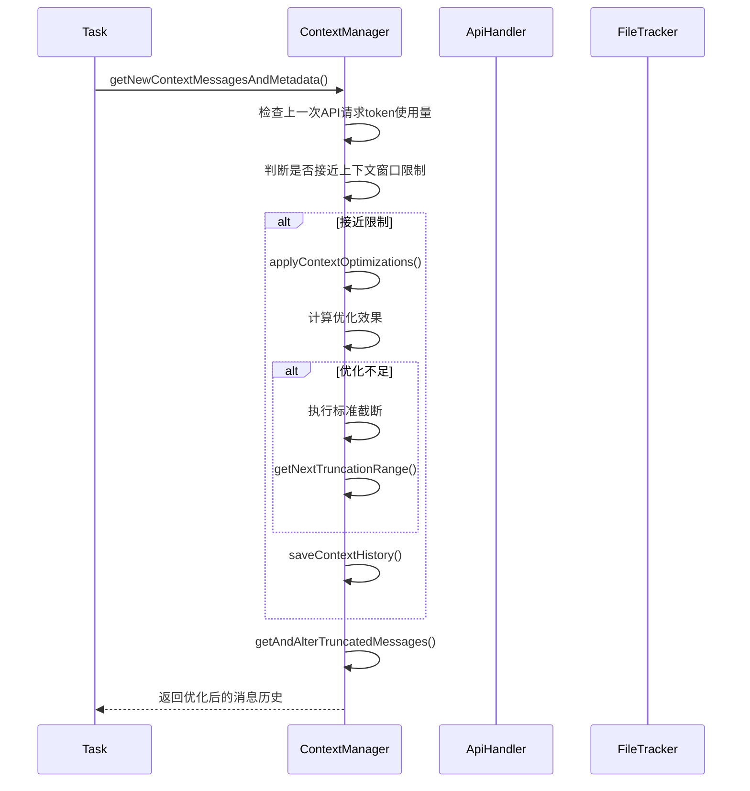
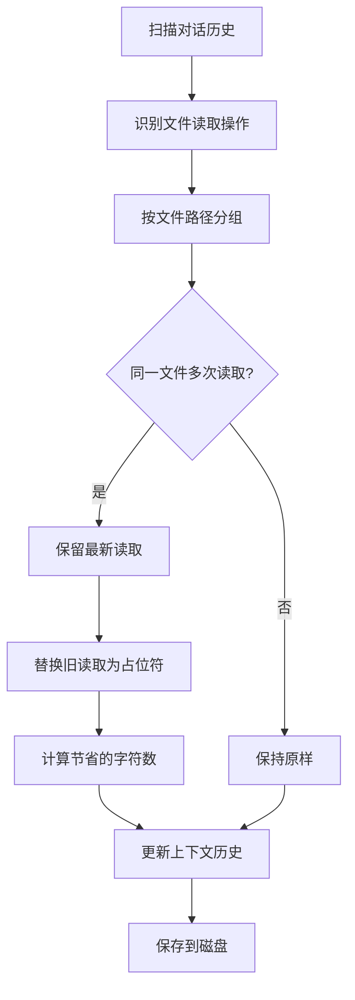
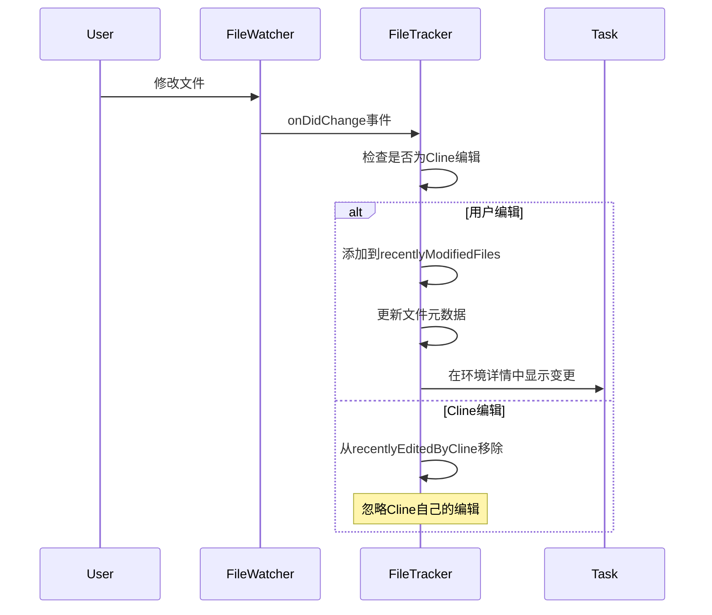

# Cline上下文管理机制深度分析

基于对Cline源码的深入分析，详细解析其智能上下文管理系统的实现原理和技术细节。

## 🎯 上下文管理概览

Cline的上下文管理系统是其核心技术之一，负责在有限的上下文窗口内智能地管理对话历史、文件内容和工具调用结果，确保AI能够获得最相关的信息来完成任务。

### 核心设计目标
1. **智能截断**: 在接近上下文窗口限制时自动截断历史对话
2. **内容去重**: 识别并压缩重复的文件读取操作
3. **文件跟踪**: 监控文件变更，防止上下文过期
4. **状态持久化**: 保存上下文变更历史，支持任务恢复
5. **环境感知**: 动态收集工作目录、终端状态、文件变更等环境信息

### 重要发现：Cline不建立文件索引
通过源码分析确认，**Cline并不对工作目录下的文件建立预先的索引**。相反，它采用**按需收集**的策略：

1. **动态环境详情**: 每次API请求时动态生成环境详情
2. **工具驱动**: 通过`list_files`、`read_file`等工具按需访问文件
3. **实时状态**: 收集VSCode可见文件、打开标签、终端状态等实时信息
4. **文件监控**: 只对已访问的文件设置监控器，而非全目录监控

## � 环境上下文收集算法

### 环境详情生成流程
Cline在每次API请求前都会调用`getEnvironmentDetails()`方法动态收集当前环境信息：

```typescript
// src/core/task/index.ts - Task.getEnvironmentDetails()
async getEnvironmentDetails(includeFileDetails: boolean = false) {
    let details = ""

    // 1. VSCode可见文件
    details += "\n\n# VSCode Visible Files"
    const visibleFilePaths = vscode.window.visibleTextEditors
        ?.map((editor) => editor.document?.uri?.fsPath)
        .filter(Boolean)
        .map((absolutePath) => path.relative(this.cwd, absolutePath))

    // 2. VSCode打开标签
    details += "\n\n# VSCode Open Tabs"
    const openTabPaths = vscode.window.tabGroups.all
        .flatMap((group) => group.tabs)
        .map((tab) => (tab.input as vscode.TabInputText)?.uri?.fsPath)
        .filter(Boolean)
        .map((absolutePath) => path.relative(this.cwd, absolutePath))

    // 3. 终端状态监控
    const busyTerminals = this.terminalManager.getTerminals(true)
    const inactiveTerminals = this.terminalManager.getTerminals(false)
    
    // 4. 最近修改的文件
    const recentlyModifiedFiles = this.fileContextTracker.getAndClearRecentlyModifiedFiles()
    
    // 5. 当前时间和时区
    const now = new Date()
    const formatter = new Intl.DateTimeFormat(undefined, {
        year: "numeric", month: "numeric", day: "numeric",
        hour: "numeric", minute: "numeric", second: "numeric", hour12: true,
    })
    
    // 6. 工作目录文件列表（可选）
    if (includeFileDetails) {
        const [files, didHitLimit] = await listFiles(this.cwd, true, 200)
        const result = formatResponse.formatFilesList(this.cwd, files, didHitLimit, this.clineIgnoreController)
        details += result
    }

    // 7. Git远程仓库信息
    const gitRemotes = await getGitRemoteUrls(this.cwd)
    
    // 8. 上下文窗口使用情况
    const { contextWindow } = getContextWindowInfo(this.api)
    const usagePercentage = Math.round((lastApiReqTotalTokens / contextWindow) * 100)
    details += `\n${lastApiReqTotalTokens.toLocaleString()} / ${(contextWindow / 1000).toLocaleString()}K tokens used (${usagePercentage}%)`

    return `<environment_details>\n${details.trim()}\n</environment_details>`
}
```

### 环境详情收集的关键特点

1. **实时性**: 每次API请求都重新收集，确保信息最新
2. **选择性**: 根据`includeFileDetails`参数决定是否包含文件列表
3. **过滤性**: 通过`ClineIgnoreController`过滤不相关文件
4. **状态感知**: 区分活跃和非活跃终端，监控文件变更
5. **上下文感知**: 包含token使用情况，帮助AI了解上下文限制

## �🏗️ 核心架构组件

### 1. ContextManager - 上下文管理器

#### 主要职责
```typescript
// src/core/context/context-management/ContextManager.ts
export class ContextManager {
    // 上下文历史更新映射
    private contextHistoryUpdates: Map<number, [number, Map<number, ContextUpdate[]>]>
    
    constructor() {
        this.contextHistoryUpdates = new Map()
    }
}
```

#### 核心数据结构
```typescript
// 编辑类型枚举
enum EditType {
    UNDEFINED = 0,
    NO_FILE_READ = 1,
    READ_FILE_TOOL = 2,
    ALTER_FILE_TOOL = 3,
    FILE_MENTION = 4,
}

// 上下文更新类型
type ContextUpdate = [number, string, MessageContent, MessageMetadata]
// [timestamp, updateType, update, metadata]

// 序列化格式
type SerializedContextHistory = Array<[
    number, // messageIndex
    [
        number, // EditType
        Array<[
            number, // blockIndex
            ContextUpdate[], // updates array
        ]>
    ]
]>
```

### 2. 上下文窗口管理

#### 窗口大小计算
```typescript
// src/core/context/context-management/context-window-utils.ts
export function getContextWindowInfo(api: ApiHandler) {
    let contextWindow = api.getModel().info.contextWindow || 128_000
    
    // 特殊模型处理
    if (api instanceof OpenAiHandler && api.getModel().id.toLowerCase().includes("deepseek")) {
        contextWindow = 64_000
    }

    let maxAllowedSize: number
    switch (contextWindow) {
        case 64_000: // deepseek models
            maxAllowedSize = contextWindow - 27_000
            break
        case 128_000: // most models
            maxAllowedSize = contextWindow - 30_000
            break
        case 200_000: // claude models
            maxAllowedSize = contextWindow - 40_000
            break
        default:
            maxAllowedSize = Math.max(contextWindow - 40_000, contextWindow * 0.8)
    }

    return { contextWindow, maxAllowedSize }
}
```

### 3. FileContextTracker - 文件上下文跟踪器

#### 文件状态跟踪
```typescript
// src/core/context/context-tracking/FileContextTracker.ts
export class FileContextTracker {
    private fileWatchers = new Map<string, vscode.FileSystemWatcher>()
    private recentlyModifiedFiles = new Set<string>()
    private recentlyEditedByCline = new Set<string>()

    async trackFileContext(
        filePath: string, 
        operation: "read_tool" | "user_edited" | "cline_edited" | "file_mentioned"
    ) {
        // 添加文件到元数据跟踪器
        await this.addFileToFileContextTracker(this.context, this.taskId, filePath, operation)
        
        // 为文件设置监听器
        await this.setupFileWatcher(filePath)
    }
}
```

#### 文件元数据结构
```typescript
interface FileMetadataEntry {
    path: string
    record_state: "active" | "stale"
    record_source: "read_tool" | "user_edited" | "cline_edited" | "file_mentioned"
    cline_read_date?: number
    cline_edit_date?: number
    user_edit_date?: number
}
```

## 🔄 上下文管理工作流程

### 1. 上下文评估和截断流程


### 2. 文件内容去重优化


### 3. 文件变更监控流程


## 🛠️ 核心技术实现

### 1. 智能截断算法

#### 截断范围计算
```typescript
// ContextManager.ts
public getNextTruncationRange(
    apiMessages: Anthropic.Messages.MessageParam[],
    currentDeletedRange: [number, number] | undefined,
    keep: "none" | "lastTwo" | "half" | "quarter",
): [number, number] {
    const rangeStartIndex = 2 // 保留第一对用户-助手消息
    const startOfRest = currentDeletedRange ? currentDeletedRange[1] + 1 : 2

    let messagesToRemove: number
    if (keep === "none") {
        messagesToRemove = Math.max(apiMessages.length - startOfRest, 0)
    } else if (keep === "lastTwo") {
        messagesToRemove = Math.max(apiMessages.length - startOfRest - 2, 0)
    } else if (keep === "half") {
        messagesToRemove = Math.floor((apiMessages.length - startOfRest) / 4) * 2
    } else { // quarter
        messagesToRemove = Math.floor(((apiMessages.length - startOfRest) * 3) / 4 / 2) * 2
    }

    let rangeEndIndex = startOfRest + messagesToRemove - 1
    
    // 确保最后删除的是助手消息，保持对话结构
    if (apiMessages[rangeEndIndex].role !== "assistant") {
        rangeEndIndex -= 1
    }

    return [rangeStartIndex, rangeEndIndex]
}
```

#### 上下文优化策略
```typescript
// 上下文优化主流程
private applyContextOptimizations(
    apiMessages: Anthropic.Messages.MessageParam[],
    startFromIndex: number,
    timestamp: number,
): [boolean, Set<number>] {
    // 查找并处理重复文件读取
    const [fileReadUpdatesBool, uniqueFileReadIndices] = 
        this.findAndPotentiallySaveFileReadContextHistoryUpdates(
            apiMessages,
            startFromIndex,
            timestamp,
        )

    return [fileReadUpdatesBool, uniqueFileReadIndices]
}
```

### 2. 文件内容去重机制

#### 重复文件读取检测
```typescript
// 获取可能的重复文件读取
private getPossibleDuplicateFileReads(
    apiMessages: Anthropic.Messages.MessageParam[],
    startFromIndex: number,
): [Map<string, [number, number, string, string][]>, Map<number, string[]>] {
    const fileReadIndices = new Map<string, [number, number, string, string][]>()
    const messageFilePaths = new Map<number, string[]>()

    for (let i = startFromIndex; i < apiMessages.length; i++) {
        const message = apiMessages[i]
        if (message.role === "user" && Array.isArray(message.content)) {
            const firstBlock = message.content[0]
            if (firstBlock.type === "text") {
                const matchTup = this.parsePotentialToolCall(firstBlock.text)
                
                if (matchTup) {
                    if (matchTup[0] === "read_file") {
                        this.handleReadFileToolCall(i, matchTup[1], fileReadIndices)
                    } else if (matchTup[0] === "replace_in_file" || matchTup[0] === "write_to_file") {
                        // 处理文件修改工具调用
                        this.handlePotentialFileChangeToolCalls(i, matchTup[1], secondBlock.text, fileReadIndices)
                    }
                } else {
                    // 处理文件提及
                    this.handlePotentialFileMentionCalls(i, secondBlock.text, fileReadIndices, thisExistingFileReads)
                }
            }
        }
    }

    return [fileReadIndices, messageFilePaths]
}
```

#### 文件内容替换逻辑
```typescript
// 应用文件读取上下文历史更新
private applyFileReadContextHistoryUpdates(
    fileReadIndices: Map<string, [number, number, string, string][]>,
    messageFilePaths: Map<number, string[]>,
    apiMessages: Anthropic.Messages.MessageParam[],
    timestamp: number,
): [boolean, Set<number>] {
    let didUpdate = false
    const updatedMessageIndices = new Set<number>()

    for (const [filePath, indices] of fileReadIndices.entries()) {
        // 只有当同一文件有多次读取时才处理
        if (indices.length > 1) {
            // 处理除最后一次外的所有读取（保留最新的）
            for (let i = 0; i < indices.length - 1; i++) {
                const messageIndex = indices[i][0]
                const messageType = indices[i][1]
                const replacementText = indices[i][3]

                didUpdate = true
                updatedMessageIndices.add(messageIndex)

                // 更新上下文历史
                this.updateContextHistory(messageIndex, messageType, replacementText, timestamp)
            }
        }
    }

    return [didUpdate, updatedMessageIndices]
}
```

### 3. 文件监控系统

#### 文件监听器设置
```typescript
// FileContextTracker.ts
async setupFileWatcher(filePath: string) {
    if (this.fileWatchers.has(filePath)) {
        return // 避免重复设置
    }

    const cwd = await getCwd()
    const fileUri = vscode.Uri.file(path.resolve(cwd, filePath))
    const watcher = vscode.workspace.createFileSystemWatcher(
        new vscode.RelativePattern(path.dirname(fileUri.fsPath), path.basename(fileUri.fsPath))
    )

    // 监听文件变更
    watcher.onDidChange(() => {
        if (this.recentlyEditedByCline.has(filePath)) {
            this.recentlyEditedByCline.delete(filePath) // Cline的编辑，忽略
        } else {
            this.recentlyModifiedFiles.add(filePath) // 用户编辑，需要通知
            this.trackFileContext(filePath, "user_edited")
        }
    })

    this.fileWatchers.set(filePath, watcher)
}
```

#### 文件元数据管理
```typescript
// 添加文件到上下文跟踪器
async addFileToFileContextTracker(
    context: vscode.ExtensionContext,
    taskId: string,
    filePath: string,
    source: FileMetadataEntry["record_source"],
) {
    const metadata = await getTaskMetadata(context, taskId)
    const now = Date.now()

    // 将现有条目标记为过期
    metadata.files_in_context.forEach((entry) => {
        if (entry.path === filePath && entry.record_state === "active") {
            entry.record_state = "stale"
        }
    })

    // 创建新的活跃条目
    let newEntry: FileMetadataEntry = {
        path: filePath,
        record_state: "active",
        record_source: source,
        cline_read_date: this.getLatestDateForField(filePath, "cline_read_date"),
        cline_edit_date: this.getLatestDateForField(filePath, "cline_edit_date"),
        user_edit_date: this.getLatestDateForField(filePath, "user_edit_date"),
    }

    // 根据操作类型更新时间戳
    switch (source) {
        case "user_edited":
            newEntry.user_edit_date = now
            break
        case "cline_edited":
            newEntry.cline_read_date = now
            newEntry.cline_edit_date = now
            break
        case "read_tool":
        case "file_mentioned":
            newEntry.cline_read_date = now
            break
    }

    metadata.files_in_context.push(newEntry)
    await saveTaskMetadata(context, taskId, metadata)
}
```

## 📊 性能优化策略

### 1. 字符节省计算
```typescript
// 计算上下文优化指标
private calculateContextOptimizationMetrics(
    apiMessages: Anthropic.Messages.MessageParam[],
    conversationHistoryDeletedRange: [number, number] | undefined,
    uniqueFileReadIndices: Set<number>,
): number {
    // 计算第一对消息的字符数
    const firstChunkResult = this.countCharactersAndSavingsInRange(
        apiMessages, 0, 2, uniqueFileReadIndices
    )

    // 计算剩余消息的字符数
    const secondChunkResult = this.countCharactersAndSavingsInRange(
        apiMessages,
        conversationHistoryDeletedRange ? conversationHistoryDeletedRange[1] + 1 : 2,
        apiMessages.length,
        uniqueFileReadIndices,
    )

    const totalCharacters = firstChunkResult.totalCharacters + secondChunkResult.totalCharacters
    const totalCharactersSaved = firstChunkResult.charactersSaved + secondChunkResult.charactersSaved

    return totalCharacters === 0 ? 0 : totalCharactersSaved / totalCharacters
}
```

### 2. 智能截断决策
```typescript
// 主要的上下文管理入口点
async getNewContextMessagesAndMetadata(
    apiConversationHistory: Anthropic.Messages.MessageParam[],
    clineMessages: ClineMessage[],
    api: ApiHandler,
    conversationHistoryDeletedRange: [number, number] | undefined,
    previousApiReqIndex: number,
    taskDirectory: string,
) {
    // 检查是否接近上下文窗口限制
    if (previousApiReqIndex >= 0) {
        const previousRequest = clineMessages[previousApiReqIndex]
        const { tokensIn, tokensOut, cacheWrites, cacheReads } = JSON.parse(previousRequest.text)
        const totalTokens = (tokensIn || 0) + (tokensOut || 0) + (cacheWrites || 0) + (cacheReads || 0)
        const { maxAllowedSize } = getContextWindowInfo(api)

        if (totalTokens >= maxAllowedSize) {
            // 应用上下文优化
            let [anyContextUpdates, uniqueFileReadIndices] = this.applyContextOptimizations(
                apiConversationHistory,
                conversationHistoryDeletedRange ? conversationHistoryDeletedRange[1] + 1 : 2,
                timestamp,
            )

            let needToTruncate = true
            if (anyContextUpdates) {
                // 计算优化效果
                const charactersSavedPercentage = this.calculateContextOptimizationMetrics(
                    apiConversationHistory,
                    conversationHistoryDeletedRange,
                    uniqueFileReadIndices,
                )
                
                // 如果节省了30%以上的字符，就不需要截断
                if (charactersSavedPercentage >= 0.3) {
                    needToTruncate = false
                }
            }

            if (needToTruncate) {
                // 执行标准截断
                conversationHistoryDeletedRange = this.getNextTruncationRange(
                    apiConversationHistory,
                    conversationHistoryDeletedRange,
                    totalTokens / 2 > maxAllowedSize ? "quarter" : "half",
                )
            }
        }
    }

    return {
        conversationHistoryDeletedRange,
        truncatedConversationHistory: this.getAndAlterTruncatedMessages(
            apiConversationHistory,
            conversationHistoryDeletedRange,
        ),
    }
}
```

## 🔧 状态持久化机制

### 1. 上下文历史保存
```typescript
// 保存上下文历史到磁盘
private async saveContextHistory(taskDirectory: string) {
    const serializedUpdates: SerializedContextHistory = Array.from(
        this.contextHistoryUpdates.entries()
    ).map(([messageIndex, [numberValue, innerMap]]) => [
        messageIndex, 
        [numberValue, Array.from(innerMap.entries())]
    ])

    await fs.writeFile(
        path.join(taskDirectory, GlobalFileNames.contextHistory),
        JSON.stringify(serializedUpdates),
        "utf8",
    )
}
```

### 2. 任务恢复时的上下文重建
```typescript
// 从磁盘加载保存的上下文历史
private async getSavedContextHistory(taskDirectory: string) {
    const filePath = path.join(taskDirectory, GlobalFileNames.contextHistory)
    if (await fileExistsAtPath(filePath)) {
        const data = await fs.readFile(filePath, "utf8")
        const serializedUpdates = JSON.parse(data) as SerializedContextHistory

        return new Map(
            serializedUpdates.map(([messageIndex, [numberValue, innerMapArray]]) => [
                messageIndex,
                [numberValue, new Map(innerMapArray)],
            ])
        )
    }
    return new Map()
}
```

## 🎯 上下文管理的技术优势

### 1. 智能资源利用
- **动态优化**: 根据实际使用情况动态调整上下文内容
- **内容去重**: 自动识别和压缩重复内容
- **优先级管理**: 保留最重要和最新的信息

### 2. 文件状态同步
- **实时监控**: 监控文件变更，防止上下文过期
- **状态跟踪**: 详细记录文件的读取和编辑历史
- **冲突预防**: 避免基于过期文件内容进行编辑

### 3. 任务连续性
- **状态持久化**: 完整保存上下文变更历史
- **恢复机制**: 支持任务中断后的准确恢复
- **版本控制**: 支持回滚到历史状态

### 4. 性能优化
- **渐进式截断**: 优先使用内容优化，必要时才截断
- **缓存机制**: 避免重复计算和处理
- **异步处理**: 不阻塞主要任务流程

## 📝 总结

Cline的上下文管理系统通过以下核心技术实现：

1. **ContextManager**: 智能的上下文截断和内容优化
2. **FileContextTracker**: 实时的文件状态监控和跟踪
3. **上下文窗口管理**: 动态的窗口大小计算和限制处理
4. **状态持久化**: 完整的历史记录和恢复机制

这种设计使得Cline能够在长时间的复杂任务中保持高效的上下文管理，确保AI始终能够获得最相关和最新的信息来完成任务。

PyCline在实现上下文管理时应该借鉴这些核心设计，特别是智能截断算法、文件监控机制和状态持久化策略。
