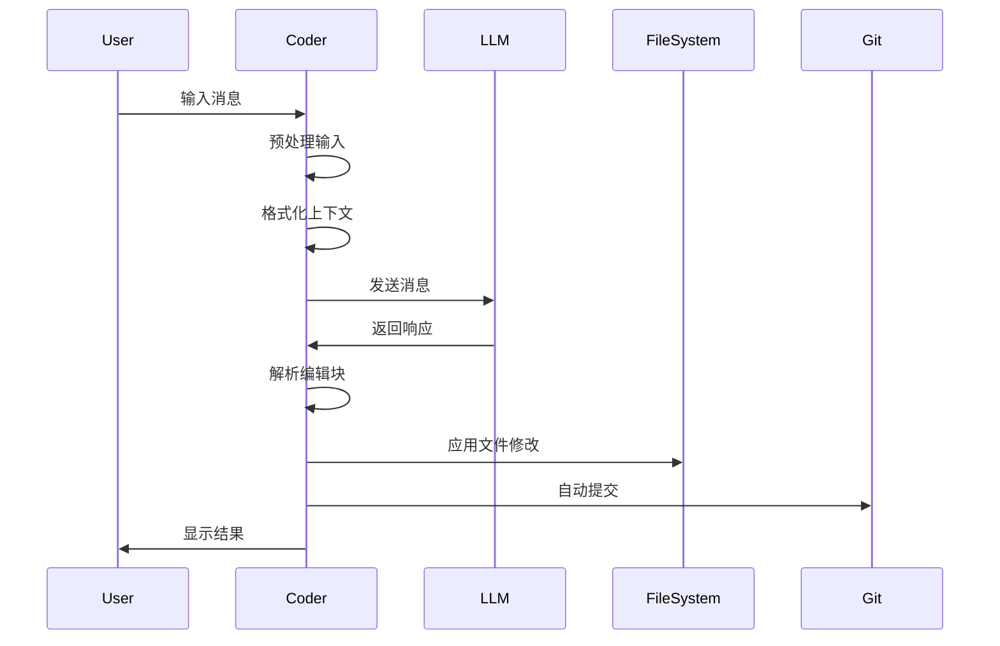
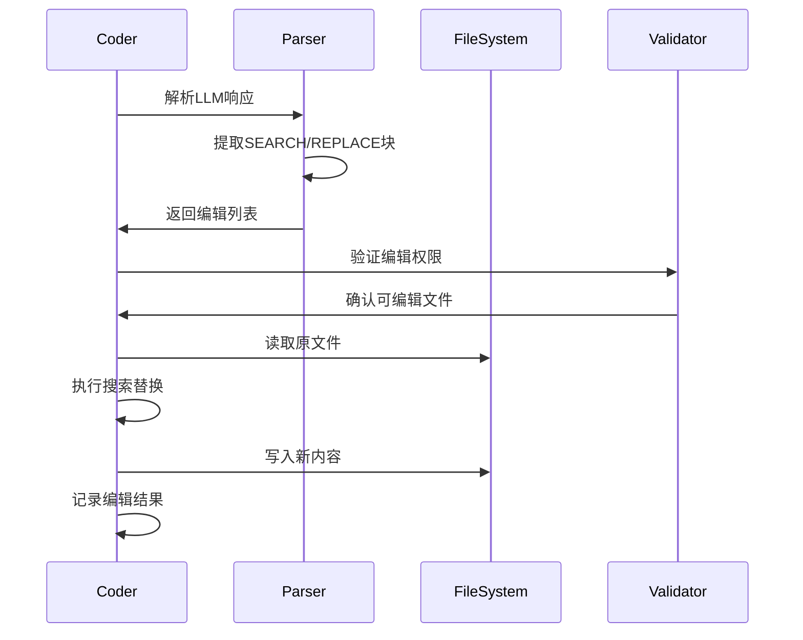

# Aider 核心架构分析

## 整体架构

Aider采用分层架构设计，主要包含以下核心组件：

```
┌─────────────────────────────────────────────────────────────┐
│                    用户界面层 (UI Layer)                      │
├─────────────────────────────────────────────────────────────┤
│  main.py  │  io.py  │  commands.py  │  args.py  │  gui.py   │
├─────────────────────────────────────────────────────────────┤
│                   控制层 (Control Layer)                     │
├─────────────────────────────────────────────────────────────┤
│              base_coder.py (核心控制器)                      │
├─────────────────────────────────────────────────────────────┤
│                   编码器层 (Coder Layer)                     │
├─────────────────────────────────────────────────────────────┤
│ editblock_coder │ wholefile_coder │ udiff_coder │ 其他编码器 │
├─────────────────────────────────────────────────────────────┤
│                   服务层 (Service Layer)                     │
├─────────────────────────────────────────────────────────────┤
│  repomap.py │ models.py │ repo.py │ linter.py │ history.py  │
├─────────────────────────────────────────────────────────────┤
│                   基础设施层 (Infrastructure)                │
├─────────────────────────────────────────────────────────────┤
│    llm.py   │  utils.py  │  analytics.py  │  exceptions.py │
└─────────────────────────────────────────────────────────────┘
```

## 核心模块详解

### 1. 主控制器 (main.py)

**功能描述**：应用程序入口点，负责初始化和协调各个组件。

**关键代码片段**：
```python
# main.py:1089-1120
def main(argv=None, input=None, output=None, force_git_root=None, return_coder=False):
    # 参数解析和配置加载
    parser = get_parser(default_config_files, git_root)
    args = parser.parse_args(argv)
    
    # 模型初始化
    main_model = models.Model(
        args.model,
        weak_model=args.weak_model,
        editor_model=args.editor_model,
        editor_edit_format=args.editor_edit_format,
        verbose=args.verbose,
    )
    
    # 创建编码器实例
    coder = Coder.create(
        main_model=main_model,
        edit_format=args.edit_format,
        io=io,
        repo=repo,
        fnames=fnames,
        # ... 其他参数
    )
```

**数据流**：
- 输入：命令行参数、配置文件
- 输出：初始化的Coder实例
- 交互：与所有其他模块进行初始化交互

### 2. 基础编码器 (base_coder.py)

**功能描述**：所有编码器的基类，定义核心的对话循环和编辑流程。

**关键代码片段**：
```python
# base_coder.py:2089-2150
def send_message(self, inp):
    self.cur_messages += [dict(role="user", content=inp)]
    
    chunks = self.format_messages()
    messages = chunks.all_messages()
    
    # 发送到LLM并处理响应
    yield from self.send(messages, functions=self.functions)
    
    # 应用编辑
    edited = self.apply_updates()
    
    # 自动提交
    if edited:
        self.auto_commit(edited)
```

**核心方法**：
- `run()`: 主对话循环
- `send_message()`: 处理单个消息
- `apply_updates()`: 应用代码修改
- `format_messages()`: 格式化上下文消息

### 3. 编辑块编码器 (editblock_coder.py)

**功能描述**：实现SEARCH/REPLACE编辑模式的具体编码器。

**关键代码片段**：
```python
# editblock_coder.py:25-45
def get_edits(self):
    content = self.partial_response_content
    
    # 解析SEARCH/REPLACE块
    edits = list(
        find_original_update_blocks(
            content,
            self.fence,
            self.get_inchat_relative_files(),
        )
    )
    
    return edits

def apply_edits(self, edits, dry_run=False):
    for edit in edits:
        path, original, updated = edit
        full_path = self.abs_root_path(path)
        
        # 执行搜索替换
        new_content = do_replace(full_path, content, original, updated, self.fence)
        
        if new_content and not dry_run:
            self.io.write_text(full_path, new_content)
```

## 关键数据结构

### 1. 消息格式
```python
# 用户消息
{
    "role": "user",
    "content": "请修改这个函数..."
}

# 助手消息
{
    "role": "assistant", 
    "content": "我将修改函数...\n\nfilename.py\n<<<<<<< SEARCH\n原代码\n=======\n新代码\n>>>>>>> REPLACE"
}

# 系统消息
{
    "role": "system",
    "content": "你是一个AI编程助手..."
}
```

### 2. 编辑块格式
```python
# 编辑元组: (文件路径, 原始内容, 更新内容)
Edit = Tuple[str, str, str]

# 标签结构
Tag = namedtuple("Tag", "rel_fname fname line name kind".split())
```

### 3. 聊天块结构
```python
class ChatChunks:
    system: List[Dict]      # 系统提示
    examples: List[Dict]    # 示例对话
    done: List[Dict]        # 历史消息
    repo: List[Dict]        # 代码库信息
    readonly_files: List[Dict]  # 只读文件
    chat_files: List[Dict]  # 聊天文件
    cur: List[Dict]         # 当前消息
    reminder: List[Dict]    # 提醒信息
```

## 核心工作流程

### 1. 消息处理流程



### 2. 编辑应用流程



## 模块间交互

### 1. Coder与RepoMap交互
```python
# base_coder.py:1234-1250
def get_repo_map(self, force_refresh=False):
    if not self.repo_map:
        return

    cur_msg_text = self.get_cur_message_text()
    mentioned_fnames = self.get_file_mentions(cur_msg_text)
    mentioned_idents = self.get_ident_mentions(cur_msg_text)

    repo_content = self.repo_map.get_repo_map(
        chat_files,
        other_files,
        mentioned_fnames=mentioned_fnames,
        mentioned_idents=mentioned_idents,
        force_refresh=force_refresh,
    )
    
    return repo_content
```

### 2. Coder与Git仓库交互
```python
# base_coder.py:2456-2480
def auto_commit(self, edited, context=None):
    if not self.repo or not self.auto_commits or self.dry_run:
        return

    if not context:
        context = self.get_context_from_history(self.cur_messages)

    res = self.repo.commit(fnames=edited, context=context, aider_edits=True, coder=self)
    if res:
        commit_hash, commit_message = res
        return self.gpt_prompts.files_content_gpt_edits.format(
            hash=commit_hash,
            message=commit_message,
        )
```

## 设计模式应用

### 1. 工厂模式 (Coder创建)
```python
# base_coder.py:95-120
@classmethod
def create(cls, main_model=None, edit_format=None, io=None, from_coder=None, **kwargs):
    # 根据edit_format选择具体的编码器实现
    for coder in coders.__all__:
        if hasattr(coder, "edit_format") and coder.edit_format == edit_format:
            res = coder(main_model, io, **kwargs)
            return res
    
    raise UnknownEditFormat(edit_format, valid_formats)
```

### 2. 策略模式 (编辑格式)
不同的编码器实现不同的编辑策略：
- `EditBlockCoder`: SEARCH/REPLACE策略
- `WholeFileCoder`: 整文件替换策略  
- `UdiffCoder`: 统一diff策略

### 3. 观察者模式 (事件分析)
```python
# base_coder.py中的事件记录
self.event("message_send", 
          main_model=self.main_model,
          edit_format=self.edit_format,
          prompt_tokens=prompt_tokens,
          completion_tokens=completion_tokens)
```

这种架构设计确保了Aider的高度可扩展性和维护性，同时保持了清晰的职责分离。
