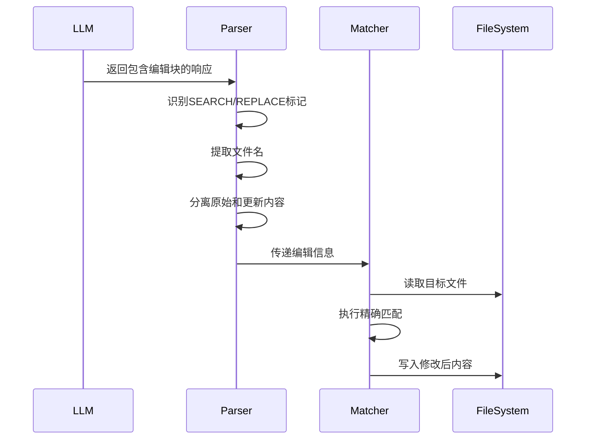

# Aider 代码编辑系统分析

## 编辑系统概述

Aider的代码编辑系统是其核心功能，通过多种编辑格式支持精确的代码修改。系统采用策略模式设计，支持不同的编辑方式以适应各种场景需求。

## 编辑格式类型

### 1. EditBlock格式 (SEARCH/REPLACE)

**应用场景**：精确的局部代码修改，是最常用的编辑格式。

**工作原理**：
- 使用`<<<<<<< SEARCH`和`>>>>>>> REPLACE`标记定义搜索和替换内容
- 通过精确匹配原始代码来定位修改位置
- 支持多个编辑块在同一响应中

**关键实现**：

```python
# editblock_coder.py:25-45
class EditBlockCoder(Coder):
    edit_format = "diff"
    gpt_prompts = EditBlockPrompts()

    def get_edits(self):
        content = self.partial_response_content
        
        # 解析SEARCH/REPLACE块
        edits = list(
            find_original_update_blocks(
                content,
                self.fence,
                self.get_inchat_relative_files(),
            )
        )
        
        # 提取shell命令
        self.shell_commands += [edit[1] for edit in edits if edit[0] is None]
        edits = [edit for edit in edits if edit[0] is not None]
        
        return edits
```

**编辑块解析流程**：



**核心解析函数**：

```python
# editblock_coder.py:400-450
def find_original_update_blocks(content, fence=DEFAULT_FENCE, valid_fnames=None):
    lines = content.splitlines(keepends=True)
    i = 0
    current_filename = None

    head_pattern = re.compile(HEAD)      # <<<<<<< SEARCH
    divider_pattern = re.compile(DIVIDER) # =======
    updated_pattern = re.compile(UPDATED) # >>>>>>> REPLACE

    while i < len(lines):
        line = lines[i]
        
        # 检测SEARCH块开始
        if head_pattern.match(line.strip()):
            # 查找文件名
            filename = find_filename(lines[max(0, i - 3) : i], fence, valid_fnames)
            
            # 提取原始内容
            original_text = []
            i += 1
            while i < len(lines) and not divider_pattern.match(lines[i].strip()):
                original_text.append(lines[i])
                i += 1
            
            # 提取更新内容
            updated_text = []
            i += 1
            while i < len(lines) and not updated_pattern.match(lines[i].strip()):
                updated_text.append(lines[i])
                i += 1
            
            yield filename, "".join(original_text), "".join(updated_text)
        
        i += 1
```

### 2. 搜索替换算法

**精确匹配策略**：

```python
# editblock_coder.py:120-140
def perfect_replace(whole_lines, part_lines, replace_lines):
    part_tup = tuple(part_lines)
    part_len = len(part_lines)

    for i in range(len(whole_lines) - part_len + 1):
        whole_tup = tuple(whole_lines[i : i + part_len])
        if part_tup == whole_tup:
            res = whole_lines[:i] + replace_lines + whole_lines[i + part_len :]
            return "".join(res)
```

**容错匹配策略**：

```python
# editblock_coder.py:180-220
def replace_part_with_missing_leading_whitespace(whole_lines, part_lines, replace_lines):
    # 处理前导空白不匹配的情况
    leading = [len(p) - len(p.lstrip()) for p in part_lines if p.strip()] + [
        len(p) - len(p.lstrip()) for p in replace_lines if p.strip()
    ]

    if leading and min(leading):
        num_leading = min(leading)
        part_lines = [p[num_leading:] if p.strip() else p for p in part_lines]
        replace_lines = [p[num_leading:] if p.strip() else p for p in replace_lines]

    # 寻找除前导空白外的精确匹配
    for i in range(len(whole_lines) - num_part_lines + 1):
        add_leading = match_but_for_leading_whitespace(
            whole_lines[i : i + num_part_lines], part_lines
        )
        
        if add_leading is not None:
            replace_lines = [add_leading + rline if rline.strip() else rline for rline in replace_lines]
            whole_lines = whole_lines[:i] + replace_lines + whole_lines[i + num_part_lines :]
            return "".join(whole_lines)
```

### 3. 错误处理和用户反馈

**匹配失败处理**：

```python
# editblock_coder.py:60-95
def apply_edits(self, edits, dry_run=False):
    failed = []
    passed = []
    
    for edit in edits:
        path, original, updated = edit
        full_path = self.abs_root_path(path)
        
        # 尝试应用编辑
        new_content = do_replace(full_path, content, original, updated, self.fence)
        
        if new_content:
            if not dry_run:
                self.io.write_text(full_path, new_content)
            passed.append(edit)
        else:
            failed.append(edit)
    
    # 生成详细的错误报告
    if failed:
        res = f"# {len(failed)} SEARCH/REPLACE blocks failed to match!\n"
        for edit in failed:
            path, original, updated = edit
            res += f"""
## SearchReplaceNoExactMatch: This SEARCH block failed to exactly match lines in {path}
<<<<<<< SEARCH
{original}=======
{updated}>>>>>>> REPLACE
"""
            # 提供相似内容建议
            did_you_mean = find_similar_lines(original, content)
            if did_you_mean:
                res += f"Did you mean to match some of these actual lines from {path}?\n{did_you_mean}\n"
        
        raise ValueError(res)
```

## 其他编辑格式

### 1. Whole File编码器

**应用场景**：完整文件替换，适用于新文件创建或大幅重构。

**特点**：
- 简单直接，不需要精确匹配
- 适合小文件或全新内容
- 降低匹配错误风险

### 2. Unified Diff编码器

**应用场景**：使用标准diff格式进行修改。

**特点**：
- 兼容标准diff工具
- 适合有经验的开发者
- 支持复杂的多处修改

### 3. 编辑器模式编码器

**应用场景**：结合架构师模式，先规划后实施。

**工作流程**：
1. 架构师模型生成修改计划
2. 编辑器模型执行具体修改
3. 双模型协作提高准确性

## 文件权限和安全检查

### 1. 编辑权限验证

```python
# base_coder.py:2350-2400
def allowed_to_edit(self, path):
    full_path = self.abs_root_path(path)
    
    # 检查文件是否在聊天中
    if full_path in self.abs_fnames:
        self.check_for_dirty_commit(path)
        return True
    
    # 检查是否被gitignore
    if self.repo and self.repo.git_ignored_file(path):
        self.io.tool_warning(f"Skipping edits to {path} that matches gitignore spec.")
        return False
    
    # 新文件创建确认
    if not Path(full_path).exists():
        if not self.io.confirm_ask("Create new file?", subject=path):
            return False
        
        # 创建文件并添加到Git
        if not utils.touch_file(full_path):
            self.io.tool_error(f"Unable to create {path}, skipping edits.")
            return False
    
    # 未在聊天中的文件需要确认
    if not self.io.confirm_ask(
        "Allow edits to file that has not been added to the chat?",
        subject=path,
    ):
        return False
    
    return True
```

### 2. 脏提交检查

```python
# base_coder.py:2320-2340
def check_for_dirty_commit(self, path):
    if not self.repo or not self.dirty_commits:
        return
    
    if not self.repo.is_dirty(path):
        return

    # 在编辑前提交未保存的更改
    self.io.tool_output(f"Committing {path} before applying edits.")
    self.need_commit_before_edits.add(path)
```

## 编辑系统的优势

### 1. 精确性
- 基于精确文本匹配，避免意外修改
- 多层容错机制处理格式差异
- 详细的错误报告和建议

### 2. 安全性
- 完整的权限检查机制
- 自动备份和版本控制
- 干运行模式预览修改

### 3. 灵活性
- 多种编辑格式适应不同场景
- 可扩展的编码器架构
- 智能文件名识别

### 4. 用户体验
- 清晰的错误信息和建议
- 交互式确认机制
- 实时反馈和进度显示

## 性能优化

### 1. 缓存机制
- 文件内容缓存减少I/O操作
- 解析结果缓存提高响应速度
- 智能缓存失效策略

### 2. 增量处理
- 只处理变更的文件
- 差异化更新策略
- 批量操作优化

### 3. 内存管理
- 大文件分块处理
- 及时释放不需要的数据
- 内存使用监控和限制

这套编辑系统的设计充分考虑了实际开发中的各种复杂情况，通过多层次的容错和安全机制，确保了代码修改的准确性和安全性。
