# Aider 代码库映射系统分析

## 系统概述

Aider的代码库映射(RepoMap)系统是其智能代码理解的核心组件。它通过分析代码结构、符号定义和引用关系，生成代码库的语义地图，为LLM提供相关的上下文信息。

## 核心功能

### 1. 代码解析与标签提取

**技术栈**：
- **Tree-sitter**：用于语法解析，支持100+编程语言
- **Pygments**：用于词法分析和语法高亮
- **grep-ast**：提供AST查询和上下文提取

**标签提取流程**：

```mermaid
sequenceDiagram
    participant RepoMap
    participant TreeSitter
    participant Pygments
    participant Cache

    RepoMap->>Cache: 检查文件缓存
    alt 缓存未命中
        RepoMap->>TreeSitter: 解析文件AST
        TreeSitter->>TreeSitter: 执行标签查询
        TreeSitter->>RepoMap: 返回定义标签
        RepoMap->>Pygments: 提取引用标签
        Pygments->>RepoMap: 返回引用信息
        RepoMap->>Cache: 更新缓存
    else 缓存命中
        Cache->>RepoMap: 返回缓存结果
    end
```



**核心实现**：

```python
# repomap.py:180-220
def get_tags_raw(self, fname, rel_fname):
    lang = filename_to_lang(fname)
    if not lang:
        return

    try:
        language = get_language(lang)
        parser = get_parser(lang)
    except Exception as err:
        print(f"Skipping file {fname}: {err}")
        return

    # 加载查询模式
    query_scm = get_scm_fname(lang)
    if not query_scm.exists():
        return
    query_scm = query_scm.read_text()

    # 解析代码
    code = self.io.read_text(fname)
    if not code:
        return
    tree = parser.parse(bytes(code, "utf-8"))

    # 执行标签查询
    query = language.query(query_scm)
    captures = query.captures(tree.root_node)

    # 处理查询结果
    for node, tag in captures:
        if tag.startswith("name.definition."):
            kind = "def"
        elif tag.startswith("name.reference."):
            kind = "ref"
        else:
            continue

        result = Tag(
            rel_fname=rel_fname,
            fname=fname,
            name=node.text.decode("utf-8"),
            kind=kind,
            line=node.start_point[0],
        )
        yield result
```

### 2. PageRank算法排序

**算法原理**：
- 将代码文件和符号构建为有向图
- 定义和引用关系作为图的边
- 使用PageRank算法计算重要性得分

**图构建过程**：

```python
# repomap.py:350-400
def get_ranked_tags(self, chat_fnames, other_fnames, mentioned_fnames, mentioned_idents, progress=None):
    import networkx as nx

    defines = defaultdict(set)      # 符号定义映射
    references = defaultdict(list)  # 符号引用映射
    definitions = defaultdict(set)  # 定义详情映射
    personalization = dict()        # 个性化权重

    # 构建图的节点和边
    for ident in idents:
        definers = defines[ident]
        
        # 计算权重倍数
        mul = 1.0
        if ident in mentioned_idents:
            mul *= 10  # 提及的标识符权重更高
        if (is_snake or is_kebab or is_camel) and len(ident) >= 8:
            mul *= 10  # 长命名权重更高
        if ident.startswith("_"):
            mul *= 0.1  # 私有成员权重降低
        if len(defines[ident]) > 5:
            mul *= 0.1  # 过度定义的符号权重降低

        # 添加边到图中
        for referencer, num_refs in Counter(references[ident]).items():
            for definer in definers:
                use_mul = mul
                if referencer in chat_rel_fnames:
                    use_mul *= 50  # 聊天文件中的引用权重更高

                num_refs = math.sqrt(num_refs)  # 平方根缩放
                G.add_edge(referencer, definer, weight=use_mul * num_refs, ident=ident)

    # 执行PageRank算法
    if personalization:
        pers_args = dict(personalization=personalization, dangling=personalization)
    else:
        pers_args = dict()

    try:
        ranked = nx.pagerank(G, weight="weight", **pers_args)
    except ZeroDivisionError:
        ranked = nx.pagerank(G, weight="weight")

    return ranked_tags
```

**权重计算策略**：


### 3. 智能上下文选择

**二分搜索优化**：

```python
# repomap.py:500-550
def get_ranked_tags_map_uncached(self, chat_fnames, other_fnames=None, max_map_tokens=None, mentioned_fnames=None, mentioned_idents=None):
    ranked_tags = self.get_ranked_tags(
        chat_fnames, other_fnames, mentioned_fnames, mentioned_idents, progress=spin.step
    )

    num_tags = len(ranked_tags)
    lower_bound = 0
    upper_bound = num_tags
    best_tree = None
    best_tree_tokens = 0

    # 二分搜索最优token数量
    middle = min(int(max_map_tokens // 25), num_tags)
    while lower_bound <= upper_bound:
        tree = self.to_tree(ranked_tags[:middle], chat_rel_fnames)
        num_tokens = self.token_count(tree)

        pct_err = abs(num_tokens - max_map_tokens) / max_map_tokens
        ok_err = 0.15
        
        if (num_tokens <= max_map_tokens and num_tokens > best_tree_tokens) or pct_err < ok_err:
            best_tree = tree
            best_tree_tokens = num_tokens
            
            if pct_err < ok_err:
                break

        if num_tokens < max_map_tokens:
            lower_bound = middle + 1
        else:
            upper_bound = middle - 1

        middle = int((lower_bound + upper_bound) // 2)

    return best_tree
```

### 4. 代码上下文渲染

**TreeContext集成**：

```python
# repomap.py:580-620
def render_tree(self, abs_fname, rel_fname, lois):
    mtime = self.get_mtime(abs_fname)
    key = (rel_fname, tuple(sorted(lois)), mtime)

    if key in self.tree_cache:
        return self.tree_cache[key]

    # 创建或获取TreeContext
    if (rel_fname not in self.tree_context_cache 
        or self.tree_context_cache[rel_fname]["mtime"] != mtime):
        
        code = self.io.read_text(abs_fname) or ""
        if not code.endswith("\n"):
            code += "\n"

        context = TreeContext(
            rel_fname,
            code,
            color=False,
            line_number=False,
            child_context=False,
            last_line=False,
            margin=0,
            mark_lois=False,
            loi_pad=0,
            show_top_of_file_parent_scope=False,
        )
        self.tree_context_cache[rel_fname] = {"context": context, "mtime": mtime}

    # 设置关注行并格式化
    context = self.tree_context_cache[rel_fname]["context"]
    context.lines_of_interest = set()
    context.add_lines_of_interest(lois)
    context.add_context()
    res = context.format()
    
    self.tree_cache[key] = res
    return res
```

## 缓存系统

### 1. 多层缓存架构


### 2. 缓存实现

**磁盘缓存**：

```python
# repomap.py:120-160
def load_tags_cache(self):
    path = Path(self.root) / self.TAGS_CACHE_DIR
    try:
        self.TAGS_CACHE = Cache(path)
    except SQLITE_ERRORS as e:
        self.tags_cache_error(e)

def get_tags(self, fname, rel_fname):
    file_mtime = self.get_mtime(fname)
    if file_mtime is None:
        return []

    cache_key = fname
    try:
        val = self.TAGS_CACHE.get(cache_key)
    except SQLITE_ERRORS as e:
        self.tags_cache_error(e)
        val = self.TAGS_CACHE.get(cache_key)

    # 检查缓存有效性
    if val is not None and val.get("mtime") == file_mtime:
        try:
            return self.TAGS_CACHE[cache_key]["data"]
        except SQLITE_ERRORS as e:
            self.tags_cache_error(e)
            return self.TAGS_CACHE[cache_key]["data"]

    # 缓存未命中，重新计算
    data = list(self.get_tags_raw(fname, rel_fname))
    
    try:
        self.TAGS_CACHE[cache_key] = {"mtime": file_mtime, "data": data}
    except SQLITE_ERRORS as e:
        self.tags_cache_error(e)
        self.TAGS_CACHE[cache_key] = {"mtime": file_mtime, "data": data}

    return data
```

**内存缓存**：

```python
# repomap.py:450-480
def get_ranked_tags_map(self, chat_fnames, other_fnames=None, max_map_tokens=None, mentioned_fnames=None, mentioned_idents=None, force_refresh=False):
    # 创建缓存键
    cache_key = [
        tuple(sorted(chat_fnames)) if chat_fnames else None,
        tuple(sorted(other_fnames)) if other_fnames else None,
        max_map_tokens,
    ]

    if self.refresh == "auto":
        cache_key += [
            tuple(sorted(mentioned_fnames)) if mentioned_fnames else None,
            tuple(sorted(mentioned_idents)) if mentioned_idents else None,
        ]
    cache_key = tuple(cache_key)

    # 缓存策略判断
    use_cache = False
    if not force_refresh:
        if self.refresh == "manual" and self.last_map:
            return self.last_map
        elif self.refresh == "files":
            use_cache = True
        elif self.refresh == "auto":
            use_cache = self.map_processing_time > 1.0

        if use_cache and cache_key in self.map_cache:
            return self.map_cache[cache_key]

    # 生成新的映射
    result = self.get_ranked_tags_map_uncached(
        chat_fnames, other_fnames, max_map_tokens, mentioned_fnames, mentioned_idents
    )
    
    self.map_cache[cache_key] = result
    self.last_map = result
    return result
```

## 性能优化策略

### 1. 增量更新

**文件变更检测**：
- 基于mtime的变更检测
- 只重新处理变更的文件
- 保持未变更文件的缓存

### 2. 并行处理

**多线程标签提取**：
- 文件解析可以并行进行
- I/O密集型操作的异步处理
- 进度反馈和用户体验优化

### 3. 内存管理

**大型代码库优化**：
- 分批处理文件
- 及时释放不需要的数据
- 内存使用监控

```python
# repomap.py:300-330
if len(fnames) - cache_size > 100:
    self.io.tool_output(
        "Initial repo scan can be slow in larger repos, but only happens once."
    )
    fnames = tqdm(fnames, desc="Scanning repo")
    showing_bar = True
else:
    showing_bar = False

for fname in fnames:
    if progress and not showing_bar:
        progress(f"{UPDATING_REPO_MAP_MESSAGE}: {fname}")
    
    # 处理单个文件...
```

## 智能特性

### 1. 文件重要性过滤

**特殊文件识别**：
```python
# 通过filter_important_files识别重要文件
special_fnames = filter_important_files(other_rel_fnames)
ranked_tags_fnames = set(tag[0] for tag in ranked_tags)
special_fnames = [fn for fn in special_fnames if fn not in ranked_tags_fnames]
special_fnames = [(fn,) for fn in special_fnames]

# 将特殊文件放在前面
ranked_tags = special_fnames + ranked_tags
```

### 2. 上下文感知

**提及文件和标识符的智能识别**：
- 从对话内容中提取文件名
- 识别代码标识符的引用
- 动态调整相关性权重

### 3. 语言特定优化

**多语言支持**：
- 每种语言的特定查询模式
- 语言特定的符号识别规则
- 适应不同语言的命名约定

## 系统优势

### 1. 智能性
- 基于语义理解而非简单文本匹配
- 动态权重调整提高相关性
- 上下文感知的内容选择

### 2. 效率
- 多层缓存减少重复计算
- 增量更新优化性能
- 智能的token预算管理

### 3. 准确性
- 基于AST的精确解析
- PageRank算法的科学排序
- 多种容错和回退机制

### 4. 可扩展性
- 支持新编程语言的插件化架构
- 可配置的权重和参数
- 灵活的缓存策略

这套代码库映射系统为Aider提供了强大的代码理解能力，使其能够在大型代码库中准确定位相关代码，为LLM提供高质量的上下文信息。
