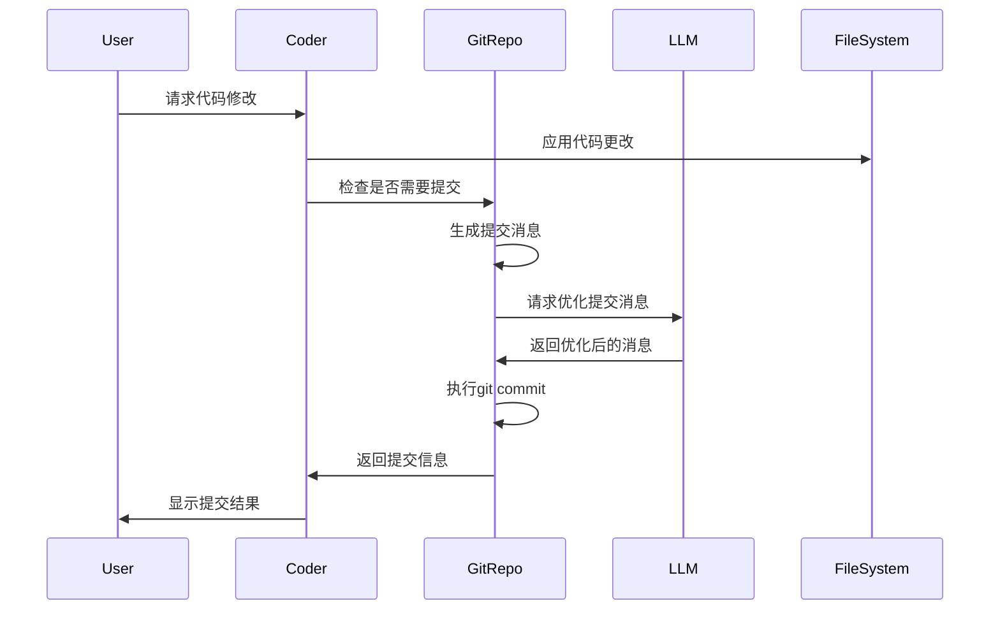
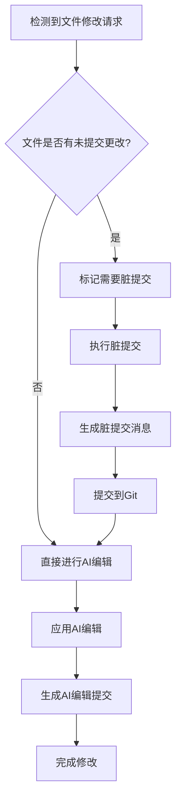

# Aider Git集成与版本控制分析

## 系统概述

Aider的Git集成是其核心特性之一，提供了完整的版本控制支持。通过自动提交、智能消息生成和变更跟踪，Aider确保所有AI修改都被妥善记录和管理。

## 核心功能

### 1. 自动提交系统

**工作流程**：



**核心实现**：

```python
# base_coder.py:2456-2480
def auto_commit(self, edited, context=None):
    if not self.repo or not self.auto_commits or self.dry_run:
        return

    if not context:
        context = self.get_context_from_history(self.cur_messages)

    try:
        res = self.repo.commit(fnames=edited, context=context, aider_edits=True, coder=self)
        if res:
            self.show_auto_commit_outcome(res)
            commit_hash, commit_message = res
            return self.gpt_prompts.files_content_gpt_edits.format(
                hash=commit_hash,
                message=commit_message,
            )

        return self.gpt_prompts.files_content_gpt_no_edits
    except ANY_GIT_ERROR as err:
        self.io.tool_error(f"Unable to commit: {str(err)}")
        return
```

### 2. 智能提交消息生成

**提交消息生成策略**：

```python
# repo.py中的提交消息生成逻辑
def commit(self, fnames=None, context=None, aider_edits=False, coder=None):
    if not fnames:
        fnames = self.get_dirty_files()
    
    if not fnames:
        return

    # 生成diff内容
    diffs = []
    for fname in fnames:
        diff = self.get_file_diff(fname)
        if diff:
            diffs.append(diff)
    
    if not diffs:
        return

    # 构建提交消息上下文
    commit_context = self.build_commit_context(diffs, context, aider_edits)
    
    # 使用LLM生成提交消息
    commit_message = self.generate_commit_message(commit_context, coder)
    
    # 执行提交
    try:
        self.repo.git.add(fnames)
        commit = self.repo.git.commit(
            "-m", commit_message,
            "--author", self.get_author_info(),
            "--no-verify"  # 跳过pre-commit hooks
        )
        
        commit_hash = self.repo.head.commit.hexsha[:7]
        return commit_hash, commit_message
        
    except git.exc.GitCommandError as err:
        raise GitError(f"Git commit failed: {err}")
```

**提交消息模板**：

```python
# 基于上下文的提交消息生成
def build_commit_context(self, diffs, context, aider_edits):
    commit_context = ""
    
    if aider_edits:
        commit_context += "# Aider AI编辑\n\n"
    
    if context:
        # 从对话历史提取关键信息
        commit_context += f"## 修改背景\n{context}\n\n"
    
    commit_context += "## 文件变更\n"
    for diff in diffs:
        commit_context += f"### {diff['filename']}\n"
        commit_context += f"```diff\n{diff['content']}\n```\n\n"
    
    commit_context += """
请基于以上信息生成一个简洁明确的Git提交消息。
格式要求：
- 第一行：简短描述（50字符以内）
- 空行
- 详细说明（如需要）

提交消息应该：
1. 使用动词开头（如：添加、修复、更新、重构）
2. 说明修改的目的和影响
3. 避免技术细节，关注业务价值
"""
    
    return commit_context
```

### 3. 脏提交处理

**脏文件检测与处理**：

```python
# base_coder.py:2320-2340
def check_for_dirty_commit(self, path):
    if not self.repo or not self.dirty_commits:
        return
    
    if not self.repo.is_dirty(path):
        return

    # 在AI编辑前提交未保存的更改
    self.io.tool_output(f"Committing {path} before applying edits.")
    self.need_commit_before_edits.add(path)

def dirty_commit(self):
    if not self.need_commit_before_edits:
        return
    if not self.dirty_commits:
        return
    if not self.repo:
        return

    # 提交脏文件
    self.repo.commit(fnames=self.need_commit_before_edits, coder=self)
    return True
```

**脏提交工作流程**：



### 4. 提交历史管理

**Aider提交标识**：

```python
# base_coder.py中的提交跟踪
def show_auto_commit_outcome(self, res):
    commit_hash, commit_message = res
    self.last_aider_commit_hash = commit_hash
    self.aider_commit_hashes.add(commit_hash)  # 跟踪所有Aider提交
    self.last_aider_commit_message = commit_message
    
    if self.show_diffs:
        self.commands.cmd_diff()  # 显示变更差异

def show_undo_hint(self):
    if not self.commit_before_message:
        return
    if self.commit_before_message[-1] != self.repo.get_head_commit_sha():
        self.io.tool_output("You can use /undo to undo and discard each aider commit.")
```

**撤销功能支持**：

```python
# commands.py中的撤销命令实现
def cmd_undo(self):
    """撤销最近的Aider提交"""
    if not self.coder.repo:
        self.io.tool_error("No git repository found")
        return

    if not self.coder.last_aider_commit_hash:
        self.io.tool_error("No aider commits to undo")
        return

    try:
        # 获取当前HEAD
        current_head = self.coder.repo.get_head_commit_sha()
        
        # 检查是否是Aider提交
        if current_head not in self.coder.aider_commit_hashes:
            self.io.tool_error("The last commit was not made by aider")
            return

        # 执行撤销
        self.coder.repo.git.reset("--hard", "HEAD~1")
        
        # 更新跟踪信息
        self.coder.aider_commit_hashes.discard(current_head)
        self.coder.last_aider_commit_hash = None
        
        self.io.tool_output(f"Undid commit {current_head}")
        
    except git.exc.GitCommandError as err:
        self.io.tool_error(f"Failed to undo commit: {err}")
```

## Git仓库初始化

### 1. 自动仓库检测

**仓库发现逻辑**：

```python
# main.py:150-180
def get_git_root():
    """尝试猜测git仓库位置"""
    try:
        repo = git.Repo(search_parent_directories=True)
        return repo.working_tree_dir
    except (git.InvalidGitRepositoryError, FileNotFoundError):
        return None

def setup_git(git_root, io):
    if git is None:
        return

    try:
        cwd = Path.cwd()
    except OSError:
        cwd = None

    repo = None

    if git_root:
        try:
            repo = git.Repo(git_root)
        except ANY_GIT_ERROR:
            pass
    elif cwd == Path.home():
        io.tool_warning(
            "You should probably run aider in your project's directory, not your home dir."
        )
        return
    elif cwd and io.confirm_ask(
        "No git repo found, create one to track aider's changes (recommended)?"
    ):
        git_root = str(cwd.resolve())
        repo = make_new_repo(git_root, io)

    return repo.working_tree_dir if repo else None
```

### 2. 新仓库创建

**仓库初始化流程**：

```python
# main.py:200-220
def make_new_repo(git_root, io):
    try:
        repo = git.Repo.init(git_root)
        check_gitignore(git_root, io, False)
    except ANY_GIT_ERROR as err:
        io.tool_error(f"Unable to create git repo in {git_root}")
        io.tool_output(str(err))
        return

    io.tool_output(f"Git repository created in {git_root}")
    return repo
```

### 3. Git配置检查

**用户信息配置**：

```python
# main.py:220-250
def setup_git(git_root, io):
    # ... 仓库检测逻辑 ...
    
    if not repo:
        return

    try:
        user_name = repo.git.config("--get", "user.name") or None
    except git.exc.GitCommandError:
        user_name = None

    try:
        user_email = repo.git.config("--get", "user.email") or None
    except git.exc.GitCommandError:
        user_email = None

    if user_name and user_email:
        return repo.working_tree_dir

    # 设置默认用户信息
    with repo.config_writer() as git_config:
        if not user_name:
            git_config.set_value("user", "name", "Your Name")
            io.tool_warning('Update git name with: git config user.name "Your Name"')
        if not user_email:
            git_config.set_value("user", "email", "you@example.com")
            io.tool_warning('Update git email with: git config user.email "you@example.com"')

    return repo.working_tree_dir
```

## .gitignore管理

### 1. 自动.gitignore更新

**智能忽略文件管理**：

```python
# main.py:280-320
def check_gitignore(git_root, io, ask=True):
    if not git_root:
        return

    try:
        repo = git.Repo(git_root)
        patterns_to_add = []

        # 检查Aider相关文件
        if not repo.ignored(".aider"):
            patterns_to_add.append(".aider*")

        # 检查环境变量文件
        env_path = Path(git_root) / ".env"
        if env_path.exists() and not repo.ignored(".env"):
            patterns_to_add.append(".env")

        if not patterns_to_add:
            return

        # 读取现有.gitignore
        gitignore_file = Path(git_root) / ".gitignore"
        if gitignore_file.exists():
            content = io.read_text(gitignore_file)
            if content and not content.endswith("\n"):
                content += "\n"
        else:
            content = ""

        # 询问用户确认
        if ask:
            io.tool_output("You can skip this check with --no-gitignore")
            if not io.confirm_ask(f"Add {', '.join(patterns_to_add)} to .gitignore (recommended)?"):
                return

        # 添加新模式
        content += "\n".join(patterns_to_add) + "\n"
        
        try:
            io.write_text(gitignore_file, content)
            io.tool_output(f"Added {', '.join(patterns_to_add)} to .gitignore")
        except OSError as e:
            io.tool_error(f"Error when trying to write to {gitignore_file}: {e}")

    except ANY_GIT_ERROR:
        return
```

### 2. 文件忽略检查

**编辑权限验证中的忽略检查**：

```python
# base_coder.py:2350-2370
def allowed_to_edit(self, path):
    full_path = self.abs_root_path(path)
    
    # 检查是否被gitignore
    if self.repo and self.repo.git_ignored_file(path):
        self.io.tool_warning(f"Skipping edits to {path} that matches gitignore spec.")
        return False
    
    # 检查是否被aiderignore
    if self.repo and self.repo.ignored_file(path):
        self.io.tool_warning(f"Skipping {path} that matches aiderignore spec.")
        return False
    
    # ... 其他检查逻辑 ...
```

## 高级Git功能

### 1. 分支管理

**分支感知操作**：
- 自动检测当前分支
- 支持在不同分支间工作
- 保持分支历史的清洁

### 2. 合并冲突处理

**冲突检测与提示**：
- 在编辑前检查潜在冲突
- 提供冲突解决建议
- 支持手动冲突解决

### 3. 远程仓库集成

**远程操作支持**：
- 检测远程仓库状态
- 提供推送提醒
- 支持多远程仓库配置

## 性能优化

### 1. Git操作缓存

**状态缓存机制**：
- 缓存仓库状态信息
- 减少重复的Git命令调用
- 智能缓存失效策略

### 2. 批量操作优化

**批量提交策略**：
- 合并相关的文件修改
- 减少提交频率
- 优化提交消息生成

### 3. 大仓库优化

**大型仓库处理**：
- 增量状态检查
- 选择性文件跟踪
- 内存使用优化

## 安全特性

### 1. 提交验证

**提交前检查**：
- 验证文件完整性
- 检查敏感信息泄露
- 确保提交消息质量

### 2. 回滚保护

**安全回滚机制**：
- 只允许撤销Aider提交
- 保护用户手动提交
- 提供详细的撤销确认

### 3. 权限管理

**文件权限检查**：
- 验证文件写入权限
- 检查Git仓库权限
- 处理权限异常情况

## 用户体验优化

### 1. 可视化反馈

**提交信息展示**：
- 清晰的提交成功提示
- 详细的变更摘要
- 直观的差异显示

### 2. 交互式确认

**用户控制机制**：
- 可选的自动提交
- 提交前预览
- 灵活的配置选项

### 3. 错误处理

**友好的错误提示**：
- 详细的错误说明
- 解决方案建议
- 自动恢复机制

这套Git集成系统为Aider提供了完整的版本控制支持，确保所有AI修改都被妥善记录和管理，同时保持了良好的用户体验和系统安全性。
