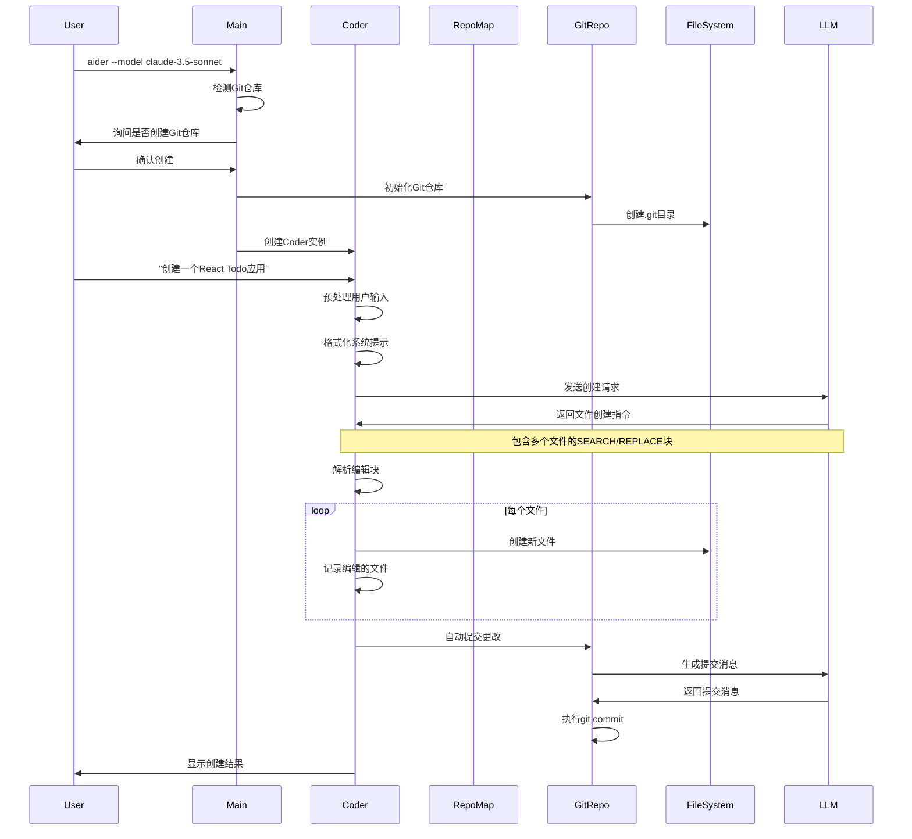
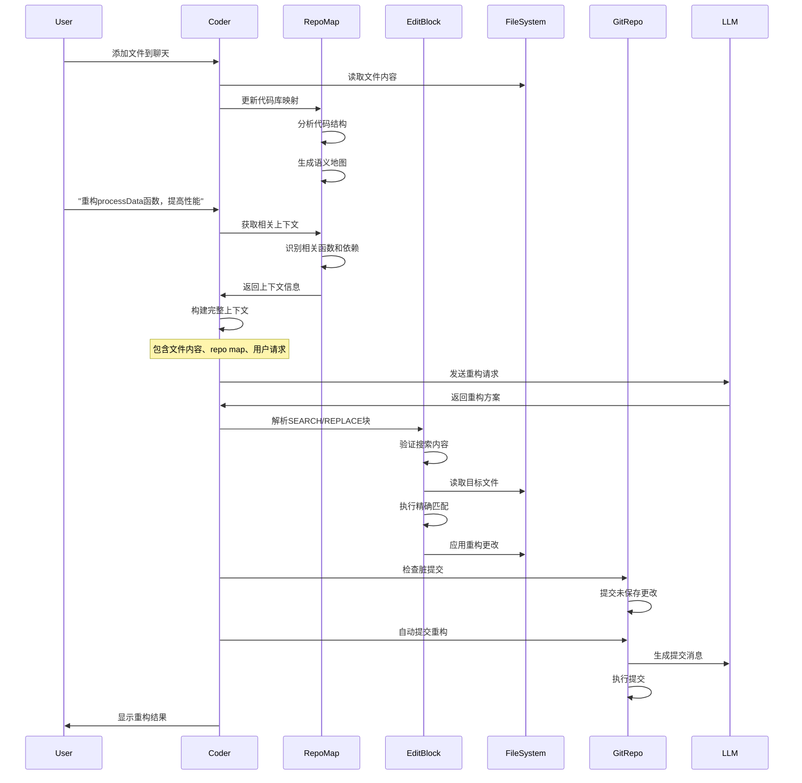
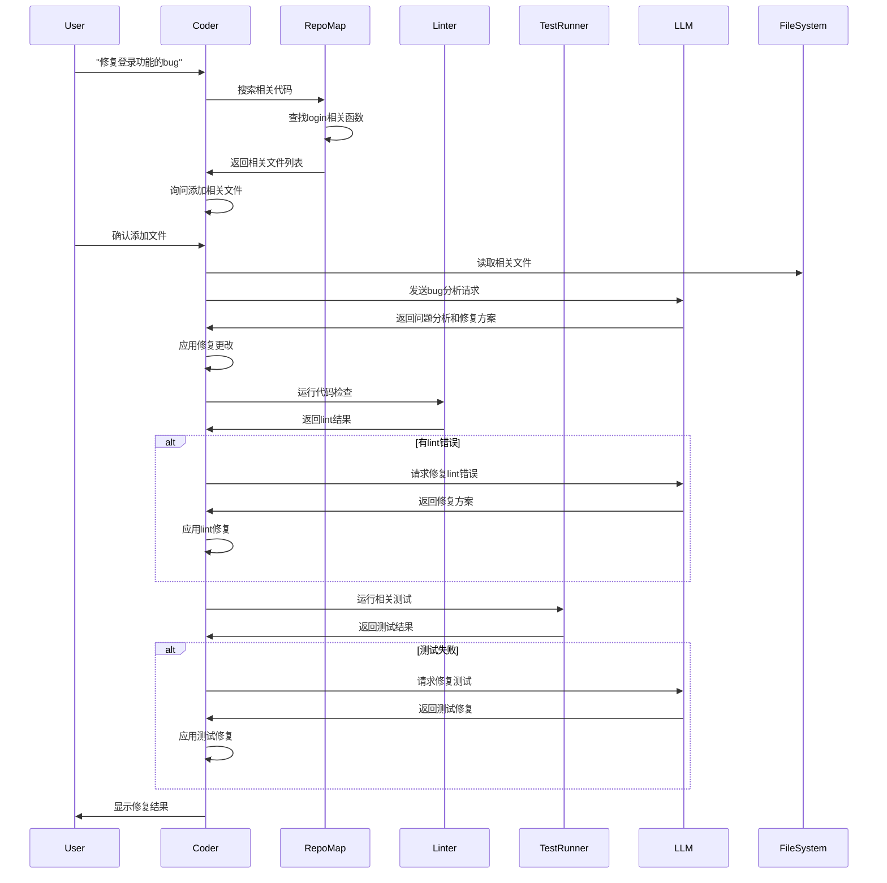
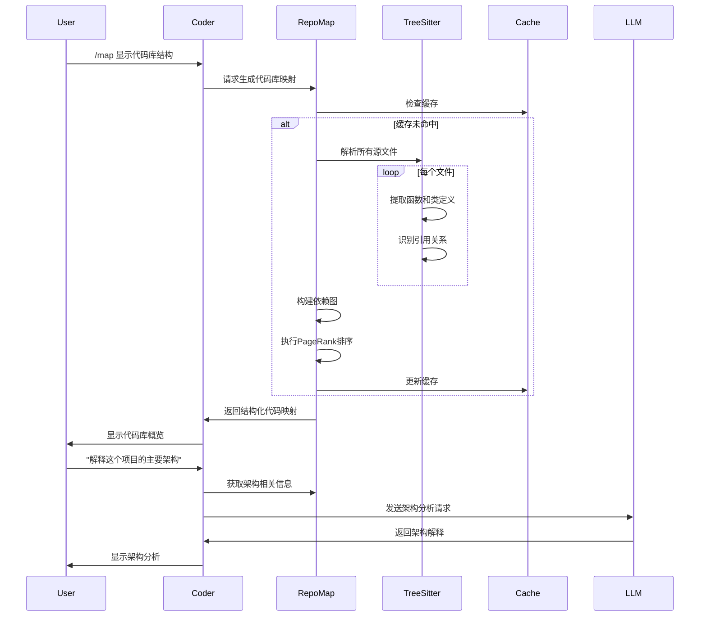

# Aider 关键场景与工作流程分析

## 场景概述

本文档分析Aider在典型开发场景中的完整工作流程，展示各个模块如何协同工作，以及关键的数据流转和交互过程。

## 场景一：新项目代码生成

### 应用场景
用户在空目录中启动Aider，要求创建一个新的Web应用项目。

### 完整工作流程



### 关键代码实现

**项目初始化**：
```python
# main.py:1200-1250
def main(argv=None, input=None, output=None, force_git_root=None, return_coder=False):
    # Git仓库检测和创建
    git_root = get_git_root()
    if not git_root:
        if io.confirm_ask("No git repo found, create one to track aider's changes (recommended)?"):
            git_root = str(Path.cwd().resolve())
            repo = make_new_repo(git_root, io)
    
    # 创建Coder实例
    coder = Coder.create(
        main_model=main_model,
        edit_format=args.edit_format,
        io=io,
        repo=repo,
        fnames=[],  # 新项目无初始文件
        auto_commits=True,
    )
```

**文件创建处理**：
```python
# editblock_coder.py:60-90
def apply_edits(self, edits, dry_run=False):
    for edit in edits:
        path, original, updated = edit
        full_path = self.abs_root_path(path)
        
        # 新文件创建（original为空）
        if not original.strip() and not Path(full_path).exists():
            if not dry_run:
                # 创建目录结构
                Path(full_path).parent.mkdir(parents=True, exist_ok=True)
                # 写入文件内容
                self.io.write_text(full_path, updated)
                # 添加到Git跟踪
                if self.repo:
                    self.repo.repo.git.add(full_path)
```

### 输入输出数据结构

**输入**：
```python
user_input = "创建一个React Todo应用，包含添加、删除、标记完成功能"
```

**LLM响应示例**：
```
我将为您创建一个React Todo应用。

package.json
```json
{
  "name": "react-todo-app",
  "version": "1.0.0",
  "dependencies": {
    "react": "^18.2.0",
    "react-dom": "^18.2.0"
  }
}
```

src/App.js
```javascript
import React, { useState } from 'react';
import './App.css';

function App() {
  const [todos, setTodos] = useState([]);
  const [inputValue, setInputValue] = useState('');

  const addTodo = () => {
    if (inputValue.trim()) {
      setTodos([...todos, { id: Date.now(), text: inputValue, completed: false }]);
      setInputValue('');
    }
  };

  // ... 其他功能实现
}
```

**输出结果**：
```python
edited_files = {
    'package.json',
    'src/App.js', 
    'src/App.css',
    'public/index.html'
}

commit_result = {
    'hash': 'a1b2c3d',
    'message': 'feat: 创建React Todo应用基础结构\n\n- 添加package.json配置\n- 实现Todo组件核心功能\n- 添加基础样式'
}
```

## 场景二：现有代码重构

### 应用场景
用户在现有项目中要求重构一个复杂的函数，提高代码可读性和性能。

### 完整工作流程



### 关键代码实现

**上下文构建**：
```python
# base_coder.py:1600-1650
def format_messages(self):
    chunks = ChatChunks()
    
    # 系统提示
    chunks.system = [dict(role="system", content=self.fmt_system_prompt(self.gpt_prompts.main_system))]
    
    # 代码库映射
    chunks.repo = self.get_repo_messages()
    
    # 聊天文件内容
    chunks.chat_files = self.get_chat_files_messages()
    
    # 当前对话
    chunks.cur = list(self.cur_messages)
    
    return chunks

def get_repo_messages(self):
    repo_content = self.get_repo_map()
    if repo_content:
        return [
            dict(role="user", content=repo_content),
            dict(role="assistant", content="Ok, I won't try and edit those files without asking first."),
        ]
    return []
```

**重构验证**：
```python
# editblock_coder.py:140-180
def replace_most_similar_chunk(whole, part, replace):
    whole, whole_lines = prep(whole)
    part, part_lines = prep(part)
    replace, replace_lines = prep(replace)

    # 尝试精确匹配
    res = perfect_replace(whole_lines, part_lines, replace_lines)
    if res:
        return res

    # 尝试容错匹配（处理空白差异）
    res = replace_part_with_missing_leading_whitespace(whole_lines, part_lines, replace_lines)
    if res:
        return res

    # 处理省略号模式
    try:
        res = try_dotdotdots(whole, part, replace)
        if res:
            return res
    except ValueError:
        pass

    return None  # 匹配失败
```

### 输入输出数据结构

**输入上下文**：
```python
context_data = {
    "chat_files": [
        {
            "path": "src/utils/dataProcessor.js",
            "content": "function processData(data) {\n  // 复杂的处理逻辑\n  for (let i = 0; i < data.length; i++) {\n    // 嵌套循环和复杂计算\n  }\n}"
        }
    ],
    "repo_map": {
        "related_functions": ["validateData", "transformData", "cacheData"],
        "dependencies": ["lodash", "moment"],
        "callers": ["src/components/DataTable.js", "src/api/dataService.js"]
    },
    "user_request": "重构processData函数，提高性能和可读性"
}
```

**LLM重构响应**：
```
我将重构processData函数，采用更高效的算法和更清晰的结构。

src/utils/dataProcessor.js
<<<<<<< SEARCH
function processData(data) {
  // 复杂的处理逻辑
  for (let i = 0; i < data.length; i++) {
    // 嵌套循环和复杂计算
  }
}
=======
function processData(data) {
  // 输入验证
  if (!Array.isArray(data) || data.length === 0) {
    return [];
  }

  // 使用map替代for循环，提高可读性
  return data
    .filter(item => item && typeof item === 'object')
    .map(item => processItem(item))
    .filter(Boolean);
}

// 提取单项处理逻辑
function processItem(item) {
  try {
    // 具体的处理逻辑
    return {
      ...item,
      processed: true,
      timestamp: Date.now()
    };
  } catch (error) {
    console.warn('Failed to process item:', item, error);
    return null;
  }
}
>>>>>>> REPLACE
```

## 场景三：错误修复与调试

### 应用场景
用户报告一个bug，Aider需要分析代码、定位问题并提供修复方案。

### 完整工作流程



### 关键代码实现

**智能文件发现**：
```python
# base_coder.py:1850-1900
def get_file_mentions(self, content, ignore_current=False):
    words = set(word for word in content.split())
    words = set(word.rstrip(",.!;:?") for word in words)
    
    if ignore_current:
        addable_rel_fnames = self.get_all_relative_files()
    else:
        addable_rel_fnames = self.get_addable_relative_files()

    mentioned_rel_fnames = set()
    fname_to_rel_fnames = {}
    
    # 精确文件名匹配
    for rel_fname in addable_rel_fnames:
        normalized_rel_fname = rel_fname.replace("\\", "/")
        normalized_words = set(word.replace("\\", "/") for word in words)
        if normalized_rel_fname in normalized_words:
            mentioned_rel_fnames.add(rel_fname)

    # 基名匹配（如login.js匹配"login"）
    for fname, rel_fnames in fname_to_rel_fnames.items():
        if len(rel_fnames) == 1 and fname in words:
            mentioned_rel_fnames.add(rel_fnames[0])

    return mentioned_rel_fnames

def check_for_file_mentions(self, content):
    mentioned_rel_fnames = self.get_file_mentions(content)
    
    if mentioned_rel_fnames:
        for rel_fname in sorted(mentioned_rel_fnames):
            if self.io.confirm_ask("Add file to the chat?", subject=rel_fname):
                self.add_rel_fname(rel_fname)
```

**自动测试集成**：
```python
# base_coder.py:2200-2250
def send_message(self, inp):
    # ... 应用编辑 ...
    edited = self.apply_updates()
    
    if edited:
        # 自动lint检查
        if self.auto_lint:
            lint_errors = self.lint_edited(edited)
            if lint_errors:
                ok = self.io.confirm_ask("Attempt to fix lint errors?")
                if ok:
                    self.reflected_message = lint_errors
                    return

        # 自动测试
        if self.auto_test:
            test_errors = self.commands.cmd_test(self.test_cmd)
            if test_errors:
                ok = self.io.confirm_ask("Attempt to fix test errors?")
                if ok:
                    self.reflected_message = test_errors
                    return
```

### 输入输出数据结构

**Bug报告输入**：
```python
bug_report = {
    "description": "登录功能无法正常工作，用户点击登录按钮后没有反应",
    "steps_to_reproduce": [
        "1. 打开登录页面",
        "2. 输入用户名和密码", 
        "3. 点击登录按钮",
        "4. 页面没有跳转，也没有错误提示"
    ],
    "expected_behavior": "应该跳转到用户仪表板",
    "actual_behavior": "页面保持不变，没有任何反应"
}
```

**分析结果**：
```python
analysis_result = {
    "identified_issues": [
        {
            "file": "src/components/LoginForm.js",
            "line": 45,
            "issue": "事件处理函数中缺少preventDefault调用",
            "severity": "high"
        },
        {
            "file": "src/api/authService.js", 
            "line": 23,
            "issue": "API调用缺少错误处理",
            "severity": "medium"
        }
    ],
    "suggested_fixes": [
        "添加preventDefault防止表单默认提交",
        "添加错误处理和用户反馈",
        "修复异步状态管理"
    ]
}
```

## 场景四：代码库探索与理解

### 应用场景
用户接手一个新的代码库，需要理解其结构和关键功能。

### 完整工作流程



### 关键代码实现

**代码库映射生成**：
```python
# repomap.py:400-450
def get_ranked_tags(self, chat_fnames, other_fnames, mentioned_fnames, mentioned_idents, progress=None):
    import networkx as nx

    defines = defaultdict(set)
    references = defaultdict(list)
    personalization = dict()

    # 构建符号定义和引用图
    for fname in fnames:
        tags = list(self.get_tags(fname, rel_fname))
        for tag in tags:
            if tag.kind == "def":
                defines[tag.name].add(rel_fname)
            elif tag.kind == "ref":
                references[tag.name].append(rel_fname)

    # 创建有向图
    G = nx.MultiDiGraph()
    
    for ident in idents:
        definers = defines[ident]
        
        # 计算权重
        mul = 1.0
        if ident in mentioned_idents:
            mul *= 10
        if len(ident) >= 8 and any(c.isupper() for c in ident):
            mul *= 10  # 长驼峰命名权重更高
        
        # 添加边
        for referencer, num_refs in Counter(references[ident]).items():
            for definer in definers:
                G.add_edge(referencer, definer, weight=mul * math.sqrt(num_refs), ident=ident)

    # PageRank排序
    ranked = nx.pagerank(G, weight="weight", personalization=personalization)
    return self.build_ranked_output(ranked, defines, references)
```

**智能上下文选择**：
```python
# repomap.py:500-550
def get_ranked_tags_map_uncached(self, chat_fnames, other_fnames=None, max_map_tokens=None, mentioned_fnames=None, mentioned_idents=None):
    ranked_tags = self.get_ranked_tags(chat_fnames, other_fnames, mentioned_fnames, mentioned_idents)

    # 二分搜索最优token数量
    lower_bound = 0
    upper_bound = len(ranked_tags)
    best_tree = None
    best_tree_tokens = 0

    while lower_bound <= upper_bound:
        middle = (lower_bound + upper_bound) // 2
        tree = self.to_tree(ranked_tags[:middle], chat_rel_fnames)
        num_tokens = self.token_count(tree)

        if num_tokens <= max_map_tokens and num_tokens > best_tree_tokens:
            best_tree = tree
            best_tree_tokens = num_tokens

        if num_tokens < max_map_tokens:
            lower_bound = middle + 1
        else:
            upper_bound = middle - 1

    return best_tree
```

### 输入输出数据结构

**代码库扫描结果**：
```python
repo_structure = {
    "total_files": 156,
    "languages": ["JavaScript", "Python", "CSS", "HTML"],
    "key_directories": {
        "src/": "主要源代码",
        "tests/": "测试文件",
        "docs/": "文档",
        "config/": "配置文件"
    },
    "important_files": [
        {
            "path": "src/app.js",
            "type": "entry_point",
            "importance": 0.95,
            "functions": ["initApp", "setupRoutes", "configureMiddleware"]
        },
        {
            "path": "src/models/User.js", 
            "type": "model",
            "importance": 0.87,
            "functions": ["authenticate", "authorize", "getUserProfile"]
        }
    ]
}
```

**架构分析输出**：
```python
architecture_analysis = {
    "pattern": "MVC (Model-View-Controller)",
    "layers": [
        {
            "name": "Presentation Layer",
            "files": ["src/views/", "src/components/"],
            "responsibility": "用户界面和交互"
        },
        {
            "name": "Business Logic Layer", 
            "files": ["src/controllers/", "src/services/"],
            "responsibility": "业务逻辑处理"
        },
        {
            "name": "Data Layer",
            "files": ["src/models/", "src/database/"],
            "responsibility": "数据存储和访问"
        }
    ],
    "key_patterns": [
        "Dependency Injection",
        "Repository Pattern", 
        "Factory Pattern"
    ],
    "entry_points": ["src/app.js", "src/server.js"],
    "external_dependencies": ["express", "mongoose", "jwt"]
}
```

## 性能指标与优化

### 关键性能指标

**响应时间**：
```python
performance_metrics = {
    "repo_map_generation": {
        "small_repo": "< 2s (< 100 files)",
        "medium_repo": "< 10s (100-1000 files)", 
        "large_repo": "< 30s (> 1000 files)"
    },
    "edit_application": {
        "simple_edit": "< 100ms",
        "complex_edit": "< 500ms",
        "multi_file_edit": "< 2s"
    },
    "llm_response": {
        "depends_on": "model and provider",
        "typical_range": "2-30s"
    }
}
```

**内存使用**：
```python
memory_usage = {
    "base_overhead": "50-100MB",
    "per_file_cache": "1-5KB", 
    "repo_map_cache": "10-50MB",
    "llm_context": "varies by model"
}
```

### 优化策略

**缓存优化**：
- 多层缓存架构（内存+磁盘）
- 智能缓存失效策略
- 增量更新机制

**并发处理**：
- 文件解析并行化
- 异步I/O操作
- 后台缓存预热

**内存管理**：
- 及时释放不需要的数据
- 大文件分块处理
- 内存使用监控

这些关键场景展示了Aider如何通过各个模块的协同工作，为用户提供智能、高效的AI编程体验。每个场景都体现了系统的核心设计原则：智能化、自动化和用户友好。
