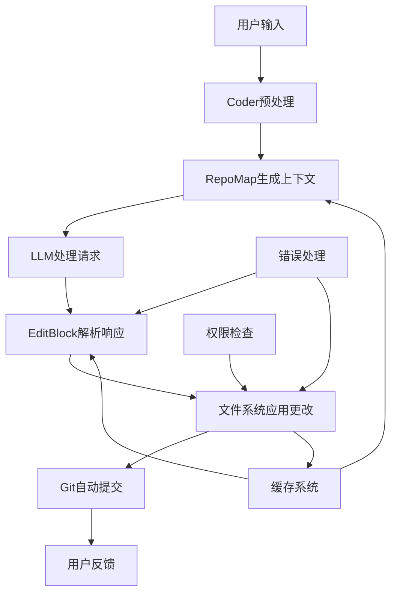

# Aider 代码分析文档

## 文档概述

本目录包含对Aider AI编程助手的全面代码分析，深入解析其架构设计、核心功能和关键实现。文档采用模块化组织，便于独立阅读和维护。

## 文档结构

### [01-overview.md](./01-overview.md) - 项目概览
- **内容**：Aider项目的整体介绍和核心功能概述
- **适合读者**：所有希望了解Aider的开发者
- **关键内容**：
  - 项目简介和技术特点
  - 核心功能模块介绍
  - 应用场景分析
  - 与其他工具的对比

### [02-core-architecture.md](./02-core-architecture.md) - 核心架构分析
- **内容**：Aider的整体架构设计和模块关系
- **适合读者**：架构师、高级开发者
- **关键内容**：
  - 分层架构设计
  - 核心模块详解
  - 关键数据结构
  - 设计模式应用

### [03-edit-system-analysis.md](./03-edit-system-analysis.md) - 代码编辑系统
- **内容**：Aider的代码编辑机制深度分析
- **适合读者**：对代码编辑算法感兴趣的开发者
- **关键内容**：
  - SEARCH/REPLACE编辑格式
  - 搜索替换算法实现
  - 错误处理和用户反馈
  - 文件权限和安全检查

### [04-repomap-system-analysis.md](./04-repomap-system-analysis.md) - 代码库映射系统
- **内容**：智能代码理解和上下文生成机制
- **适合读者**：对AST解析和图算法感兴趣的开发者
- **关键内容**：
  - Tree-sitter代码解析
  - PageRank算法排序
  - 智能上下文选择
  - 多层缓存系统

### [05-git-integration-analysis.md](./05-git-integration-analysis.md) - Git集成与版本控制
- **内容**：Aider的Git集成功能详细分析
- **适合读者**：关注版本控制集成的开发者
- **关键内容**：
  - 自动提交系统
  - 智能提交消息生成
  - 脏提交处理
  - .gitignore管理

### [06-key-scenarios-workflows.md](./06-key-scenarios-workflows.md) - 关键场景与工作流程
- **内容**：典型使用场景的完整工作流程分析
- **适合读者**：希望深入理解系统运行机制的开发者
- **关键内容**：
  - 新项目代码生成流程
  - 现有代码重构流程
  - 错误修复与调试流程
  - 代码库探索与理解流程

## 技术亮点

### 1. 智能代码理解
- **Tree-sitter解析**：支持100+编程语言的语法解析
- **语义分析**：基于AST的符号定义和引用关系分析
- **PageRank排序**：科学的代码重要性评估算法

### 2. 精确代码编辑
- **多格式支持**：SEARCH/REPLACE、whole file、unified diff等
- **容错机制**：处理空白差异、省略号模式等边界情况
- **安全保障**：完整的权限检查和回滚机制

### 3. 智能版本控制
- **自动提交**：基于上下文的智能提交消息生成
- **变更跟踪**：完整的AI修改历史记录
- **脏提交处理**：优雅处理未保存的用户更改

### 4. 高性能架构
- **多层缓存**：内存+磁盘的智能缓存策略
- **增量更新**：只处理变更的文件和内容
- **并发优化**：文件解析和I/O操作的并行处理

## 核心数据流

## 关键设计原则

### 1. 模块化设计
- **职责分离**：每个模块专注于特定功能
- **接口清晰**：模块间通过明确的接口交互
- **可扩展性**：支持新功能和编辑格式的插件化扩展

### 2. 用户体验优先
- **智能化**：自动识别文件、生成上下文、处理错误
- **交互式**：提供确认机制和详细反馈
- **容错性**：优雅处理各种异常情况

### 3. 性能与安全并重
- **高效缓存**：减少重复计算和I/O操作
- **安全检查**：完整的权限验证和数据保护
- **资源管理**：智能的内存和磁盘使用优化

## 学习路径建议

### 初学者路径
1. 阅读 [01-overview.md](./01-overview.md) 了解整体概念
2. 浏览 [06-key-scenarios-workflows.md](./06-key-scenarios-workflows.md) 理解使用场景
3. 参考 [02-core-architecture.md](./02-core-architecture.md) 掌握基本架构

### 进阶开发者路径
1. 深入 [03-edit-system-analysis.md](./03-edit-system-analysis.md) 理解编辑机制
2. 研究 [04-repomap-system-analysis.md](./04-repomap-system-analysis.md) 学习代码理解算法
3. 分析 [05-git-integration-analysis.md](./05-git-integration-analysis.md) 掌握版本控制集成

### 架构师路径
1. 全面阅读所有文档
2. 重点关注设计模式和架构决策
3. 分析性能优化和扩展性设计

## 代码示例索引

### 核心算法实现
- **PageRank排序**：[04-repomap-system-analysis.md](./04-repomap-system-analysis.md#pagerank算法排序)
- **搜索替换算法**：[03-edit-system-analysis.md](./03-edit-system-analysis.md#搜索替换算法)
- **上下文构建**：[06-key-scenarios-workflows.md](./06-key-scenarios-workflows.md#上下文构建)

### 关键工作流程
- **消息处理流程**：[02-core-architecture.md](./02-core-architecture.md#消息处理流程)
- **编辑应用流程**：[02-core-architecture.md](./02-core-architecture.md#编辑应用流程)
- **自动提交流程**：[05-git-integration-analysis.md](./05-git-integration-analysis.md#自动提交系统)

### 数据结构定义
- **消息格式**：[02-core-architecture.md](./02-core-architecture.md#消息格式)
- **编辑块格式**：[02-core-architecture.md](./02-core-architecture.md#编辑块格式)
- **标签结构**：[04-repomap-system-analysis.md](./04-repomap-system-analysis.md#核心实现)

## 贡献指南

### 文档维护原则
1. **独立性**：每个文档应能独立阅读
2. **完整性**：包含必要的背景信息和代码示例
3. **准确性**：代码片段应与实际实现保持同步
4. **可读性**：使用清晰的结构和适当的图表

### 更新流程
1. 修改相关文档内容
2. 更新交叉引用和链接
3. 验证代码示例的准确性
4. 更新本README的索引信息

## 相关资源

### 官方资源
- [Aider官网](https://aider.chat/)
- [GitHub仓库](https://github.com/Aider-AI/aider)
- [官方文档](https://aider.chat/docs/)

### 技术依赖
- [Tree-sitter](https://tree-sitter.github.io/) - 语法解析
- [NetworkX](https://networkx.org/) - 图算法
- [GitPython](https://gitpython.readthedocs.io/) - Git集成
- [LiteLLM](https://docs.litellm.ai/) - LLM接口

### 相关项目
- [Cline](https://github.com/cline/cline) - VS Code中的AI助手
- [Cursor](https://cursor.sh/) - AI代码编辑器
- [GitHub Copilot](https://github.com/features/copilot) - AI代码补全

---

*本文档集合旨在为开发者提供Aider系统的深度技术分析，帮助理解其设计思想和实现细节。如有疑问或建议，欢迎提出反馈。*
