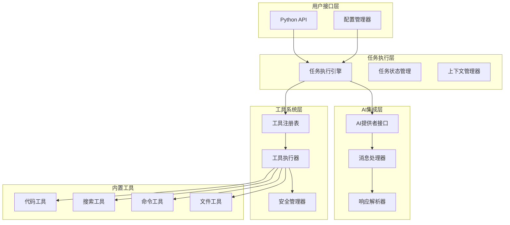
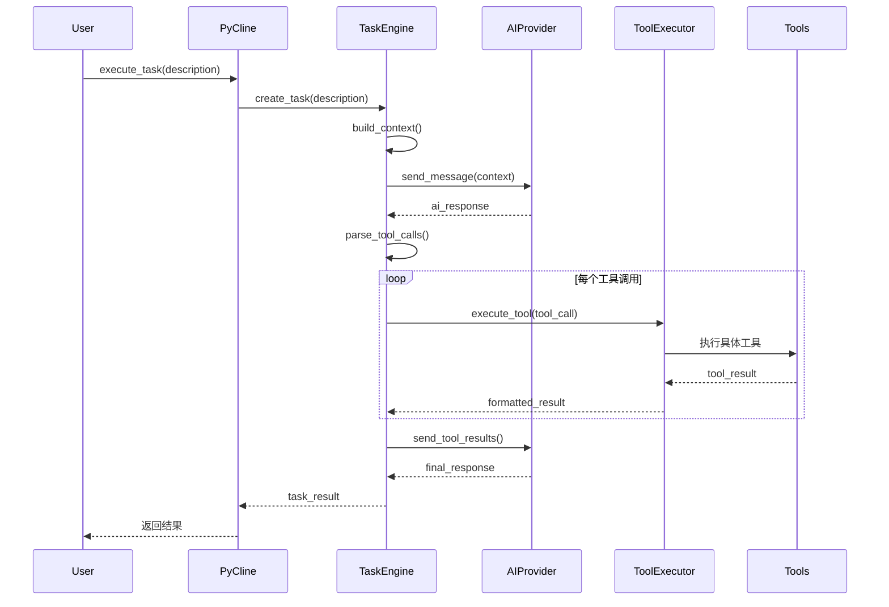
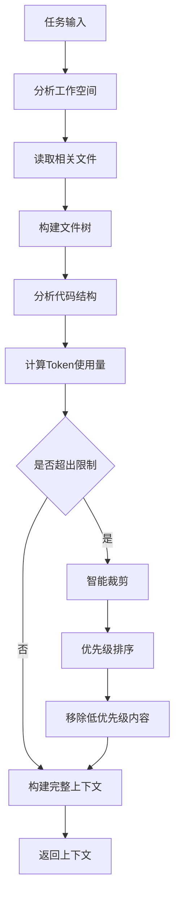

# PyCline 架构设计

## 整体架构

PyCline采用模块化架构，将核心功能分解为独立的组件，便于开发、测试和维护。

### 核心组件架构



## 核心类设计

### 1. PyCline主类

```python
class PyCline:
    """PyCline主类，提供统一的编程接口"""
    
    def __init__(self, config: Config):
        self.config = config
        self.task_engine = TaskEngine(config)
        self.tool_registry = ToolRegistry()
        self.ai_provider = AIProviderFactory.create(config.ai_provider, config)
        
    def execute_task(self, 
                    task_description: str, 
                    workspace_path: str = None,
                    context_files: List[str] = None) -> TaskResult:
        """执行编程任务"""
        
    def register_tool(self, tool: Tool):
        """注册自定义工具"""
        
    def get_task_history(self) -> List[TaskResult]:
        """获取任务历史"""
```

### 2. 任务执行引擎

```python
class TaskEngine:
    """任务执行引擎，负责协调AI和工具执行"""
    
    def __init__(self, config: Config):
        self.config = config
        self.context_manager = ContextManager()
        self.tool_executor = ToolExecutor()
        self.state = TaskState()
        
    async def execute(self, task: Task) -> TaskResult:
        """执行任务的主要逻辑"""
        
    def _build_context(self, task: Task) -> Context:
        """构建任务上下文"""
        
    def _process_ai_response(self, response: AIResponse) -> List[ToolCall]:
        """处理AI响应，提取工具调用"""
```

### 3. 工具系统

```python
class ToolRegistry:
    """工具注册表，管理所有可用工具"""
    
    def __init__(self):
        self.tools: Dict[str, Tool] = {}
        self._register_builtin_tools()
        
    def register(self, tool: Tool):
        """注册工具"""
        
    def get_tool(self, name: str) -> Tool:
        """获取工具"""
        
    def get_tool_definitions(self) -> List[Dict]:
        """获取工具定义，用于AI模型"""

class ToolExecutor:
    """工具执行器，负责安全执行工具"""
    
    def __init__(self, security_manager: SecurityManager):
        self.security_manager = security_manager
        
    async def execute(self, tool_call: ToolCall) -> ToolResult:
        """执行工具调用"""
        
    def _validate_parameters(self, tool: Tool, params: Dict) -> bool:
        """验证工具参数"""
```

## 数据流设计

### 任务执行流程



### 上下文管理流程



## 安全架构

### 安全管理器设计

```python
class SecurityManager:
    """安全管理器，控制工具执行权限"""
    
    def __init__(self, config: SecurityConfig):
        self.config = config
        self.allowed_paths = set(config.allowed_paths)
        self.blocked_commands = set(config.blocked_commands)
        
    def validate_file_access(self, path: str) -> bool:
        """验证文件访问权限"""
        
    def validate_command(self, command: str) -> bool:
        """验证命令执行权限"""
        
    def sanitize_path(self, path: str) -> str:
        """清理和验证路径"""
```

### 安全策略

1. **路径限制**: 只允许访问指定目录下的文件
2. **命令白名单**: 只允许执行安全的命令
3. **参数验证**: 严格验证所有工具参数
4. **资源限制**: 限制文件大小、执行时间等
5. **沙箱执行**: 在隔离环境中执行危险操作

## 配置系统

### 配置类设计

```python
from pydantic import BaseModel
from typing import Optional, List, Dict

class AIConfig(BaseModel):
    """AI提供者配置"""
    provider: str  # "openai", "anthropic", "local"
    api_key: Optional[str] = None
    base_url: Optional[str] = None
    model: str = "gpt-4"
    max_tokens: int = 4096
    temperature: float = 0.1

class SecurityConfig(BaseModel):
    """安全配置"""
    allowed_paths: List[str] = ["."]
    blocked_commands: List[str] = ["rm -rf", "format", "del"]
    max_file_size: int = 10 * 1024 * 1024  # 10MB
    max_execution_time: int = 30  # 30秒

class Config(BaseModel):
    """主配置类"""
    ai: AIConfig
    security: SecurityConfig = SecurityConfig()
    workspace_path: str = "."
    log_level: str = "INFO"
    enable_tools: List[str] = ["file", "command", "search"]
```

## 错误处理架构

### 异常类层次

```python
class PyClineError(Exception):
    """PyCline基础异常类"""
    pass

class TaskExecutionError(PyClineError):
    """任务执行错误"""
    pass

class ToolExecutionError(PyClineError):
    """工具执行错误"""
    pass

class AIProviderError(PyClineError):
    """AI提供者错误"""
    pass

class SecurityError(PyClineError):
    """安全相关错误"""
    pass

class ConfigurationError(PyClineError):
    """配置错误"""
    pass
```

### 错误恢复策略

1. **重试机制**: 对临时性错误进行重试
2. **降级处理**: 在某些功能不可用时提供替代方案
3. **状态恢复**: 保存任务状态，支持从中断点恢复
4. **用户反馈**: 提供清晰的错误信息和解决建议

## 扩展性设计

### 插件系统

```python
class Plugin:
    """插件基类"""
    
    def __init__(self, name: str):
        self.name = name
        
    def initialize(self, pycline: PyCline):
        """插件初始化"""
        pass
        
    def get_tools(self) -> List[Tool]:
        """获取插件提供的工具"""
        return []
        
    def on_task_start(self, task: Task):
        """任务开始时的钩子"""
        pass
        
    def on_task_complete(self, result: TaskResult):
        """任务完成时的钩子"""
        pass

class PluginManager:
    """插件管理器"""
    
    def __init__(self):
        self.plugins: List[Plugin] = []
        
    def load_plugin(self, plugin: Plugin):
        """加载插件"""
        
    def get_all_tools(self) -> List[Tool]:
        """获取所有插件提供的工具"""
```

## 性能优化

### 缓存策略

1. **文件内容缓存**: 缓存频繁访问的文件内容
2. **AI响应缓存**: 缓存相似请求的AI响应
3. **工具结果缓存**: 缓存确定性工具的执行结果
4. **上下文缓存**: 缓存构建好的上下文信息

### 异步处理

```python
import asyncio
from typing import AsyncGenerator

class AsyncTaskEngine:
    """异步任务执行引擎"""
    
    async def execute_async(self, task: Task) -> AsyncGenerator[TaskUpdate, None]:
        """异步执行任务，实时返回进度"""
        
    async def _execute_tools_parallel(self, tool_calls: List[ToolCall]) -> List[ToolResult]:
        """并行执行多个工具"""
        tasks = [self._execute_tool_async(call) for call in tool_calls]
        return await asyncio.gather(*tasks)
```

这个架构设计为PyCline提供了坚实的基础，确保系统的可扩展性、安全性和性能。
