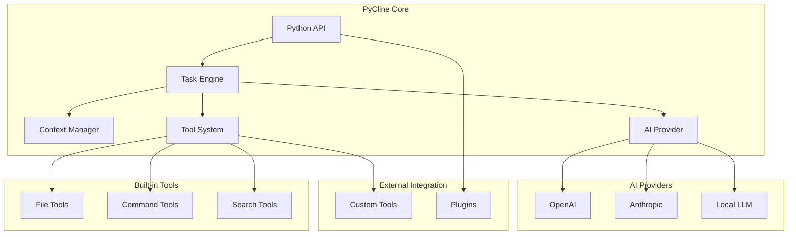

# PyCline - Python版Cline复现方案

## 项目概述

PyCline是基于Python的Cline核心功能复现，提供编程接口，使AI编程助手能够在任意Python应用中调用。与原版Cline不同，PyCline专注于核心功能，不依赖IDE、Web界面或特定UI框架。

## 核心目标

- **编程接口优先**: 提供简洁的Python API
- **智能上下文管理**: 自动分析项目结构，智能裁剪上下文，避免Token溢出
- **工具集成**: 支持文件操作、命令执行等内置工具
- **AI模型支持**: 兼容多种AI提供商
- **轻量化设计**: 最小化依赖，专注核心功能
- **可扩展性**: 支持自定义工具和插件

## 架构设计



## 分阶段实现计划

### 第一阶段：核心功能 (MVP)
- [x] 基础架构设计
- [ ] Python API接口
- [ ] AI模型集成
- [ ] 智能上下文管理
- [ ] 基础工具系统
- [ ] 任务执行引擎

### 第二阶段：工具扩展
- [ ] 高级文件操作
- [ ] 代码分析工具
- [ ] 项目管理工具
- [ ] 自定义工具接口

### 第三阶段：生态集成
- [ ] 插件系统
- [ ] 第三方工具集成
- [ ] 性能优化
- [ ] 文档和示例

## 快速开始

```python
from pycline import PyCline, Config

# 初始化配置
config = Config(
    ai_provider="openai",
    api_key="your-api-key",
    model="gpt-4"
)

# 创建PyCline实例
cline = PyCline(config)

# 执行编程任务 - 自动上下文管理
result = cline.execute_task(
    "创建一个Python函数，计算斐波那契数列",
    workspace_path="./my_project"
)

print(result.generated_code)
print(result.files_created)

# 指定上下文文件
result = cline.execute_task(
    "重构这个模块的代码",
    workspace_path="./my_project",
    context_files=["src/main.py", "src/utils.py"]
)
```

## 智能上下文管理

PyCline的核心优势之一是智能上下文管理系统，能够：

### 自动上下文构建
- **项目结构分析**: 自动分析项目目录结构和文件依赖关系
- **相关文件发现**: 基于任务描述智能识别相关文件
- **代码结构理解**: 解析代码AST，理解模块间的调用关系

### 智能上下文裁剪
- **Token使用量监控**: 实时计算上下文Token使用量
- **优先级排序**: 根据文件重要性和相关性进行优先级排序
- **动态裁剪**: 当接近Token限制时，智能移除低优先级内容

### 上下文优化策略
```python
# 自动发现相关文件
result = cline.execute_task(
    "添加日志功能到所有模块",
    workspace_path="./my_project",
    auto_discover_context=True,
    file_patterns=["*.py"]
)

# 手动指定重要文件
result = cline.execute_task(
    "优化数据库查询性能",
    workspace_path="./my_project",
    context_files=[
        "src/models.py",
        "src/database.py", 
        "config/database.yml"
    ],
    context_priority="high"  # 高优先级，尽量保留
)

# 排除不相关文件
result = cline.execute_task(
    "修复前端样式问题",
    workspace_path="./my_project",
    exclude_patterns=["*.pyc", "node_modules/*", "*.log"]
)
```

## 文档结构

- [01-architecture.md](./01-architecture.md) - 详细架构设计
- [02-api-design.md](./02-api-design.md) - API接口设计
- [03-tool-system.md](./03-tool-system.md) - 工具系统设计
- [04-ai-integration.md](./04-ai-integration.md) - AI模型集成
- [05-context-management.md](./05-context-management.md) - 上下文管理系统
- [06-implementation-plan.md](./06-implementation-plan.md) - 实现计划
- [07-examples.md](./07-examples.md) - 使用示例

## 技术栈

- **核心语言**: Python 3.8+
- **AI集成**: OpenAI API, Anthropic API, Transformers
- **工具执行**: subprocess, pathlib, ast
- **配置管理**: pydantic, yaml
- **日志记录**: loguru
- **测试框架**: pytest

## 贡献指南

1. 查看[实现计划](./06-implementation-plan.md)了解当前进度
2. 选择感兴趣的模块进行开发
3. 遵循代码规范和测试要求
4. 提交PR前确保所有测试通过

## 许可证

MIT License - 详见LICENSE文件
